# Data integration using Azure Data Factory and Azure Data Share

As customers embark on their modern data warehouse and analytics projects, they require not only more data but also more visibility into their data across their data estate. This workshop dives into how improvements to Azure Data Factory and Azure Data Share simplify data integration and management in Azure. From enabling code-free ETL/ELT to creating a comprehensive view over your data, improvements in Azure Data Factory will empower your data engineers to confidently bring in more data, and thus more value, to your enterprise. Also, learn about Azure Data Share and how you can do B2B sharing in a governed manner.

In this workshop, you will use Azure Data Factory (ADF) to ingest data from an Azure SQL database (SQL DB) into Azure Data Lake Storage gen2 (ADLS gen2). Once you land the data in the lake, you will transform it via mapping data flows, data factory's native transformation service, and sink it into Azure SQL data warehouse (SQL DW). Then, you will share the table with transformed data along with some additional data using Azure Data Share. 

The data used in this lab is New York City taxi data. To import it into your Azure SQL database, download the [taxi-data bacpac file](https://github.com/djpmsft/ADF_Labs/blob/master/sample-data/taxi-data.bacpac).

## Prerequisites

* **Azure subscription**: If you don't have an Azure subscription, create a [free account](https://azure.microsoft.com/free/) before you begin.

* **Azure SQL Database**: If you don't have a SQL DW, learn how to [create a SQL DW account](https://docs.microsoft.com/azure/sql-database/sql-database-single-database-get-started?tabs=azure-portal)

* **Azure Data Lake Storage Gen2 storage account**: If you don't have an ADLS Gen2 storage account, learn how to [create an ADLS Gen2 storage account](https://docs.microsoft.com/azure/storage/blobs/data-lake-storage-quickstart-create-account).

* **Azure SQL Data Warehouse**: If you don't have a SQL DW, learn [create a SQL DW account](https://docs.microsoft.com/azure/sql-data-warehouse/create-data-warehouse-portal).

* **Azure Data Factory**: If you have not created a data factory, see how to [create a data factory](https://docs.microsoft.com/azure/data-factory/quickstart-create-data-factory-portal).

* **Azure Data Share**: If you have not created a data share, see how to [create a data share](https://docs.microsoft.com/azure/data-share/share-your-data#create-a-data-share-account).

## Set up your Azure Data Factory environment

In this section, you will learn how to access the Azure Data Factory user experience (ADF UX) from the Azure portal. Once in the ADF UX, you will configure three linked service for each of the data stores we are using: Azure SQL DB, ADLS Gen2, and Azure SQL DW.

In Azure Data Factory, linked services define the connection information to external resources. Azure Data Factory currently supports over 85 connectors.

### Open the Azure Data Factory UX

1. Open the [Azure portal](https://portal.azure.com) in either Microsoft Edge or Google Chrome.
1. Using the search bar at the top of the page, search for 'Data Factories'

    
1. Click on your data factory resource to open up its resource blade.

    
1. Click on **Author and Monitor** to open up the ADF UX. The ADF UX can also be accessed at adf.azure.com.

    
1. You will be redirected to the homepage of the ADF UX. This page contains quick-starts, instructional videos and links to tutorials to learn data factory concepts. To start authoring, click on the pencil icon in left side-bar.

    

### Create an Azure SQL database linked service

1. The authoring page is where you create data factory resources such as pipelines, datasets, data flows, triggers and linked services. To create a linked service, click on the **Connections** button in the bottom-right corner.

    
1. In the connections tab, click **New** to add a new linked service.

    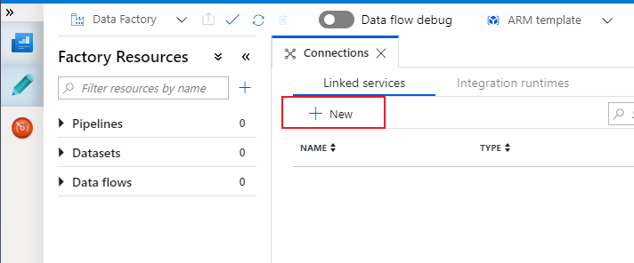
1. The first linked service you will configure is an Azure SQL DB. You can use the search bar to filter the data store list. Click on the **Azure SQL Database** tile and click continue.

    
1. In the SQL DB configuration pane, enter 'SQLDB' as your linked service name. Enter in your credentials to allow data factory to connect to your database. If you're using SQL authentication, enter in the server name, the database, your user name and password. You can verify your connection information is correct by clicking **Test connection**. Click **Create** when finished.

    

### Create an Azure SQL data warehouse linked service

1. Repeat the same process to add an Azure SQL DW linked service. In the connections tab, click **New**. Select the **Azure SQL Data Warehouse** tile and click continue.

    
1. In the linked service configuration pane, enter 'SQLDW' as your linked service name. Enter in your credentials to allow data factory to connect to your database. If you're using SQL authentication, enter in the server name, the database, your user name and password. You can verify your connection information is correct by clicking **Test connection**. Click **Create** when finished.

    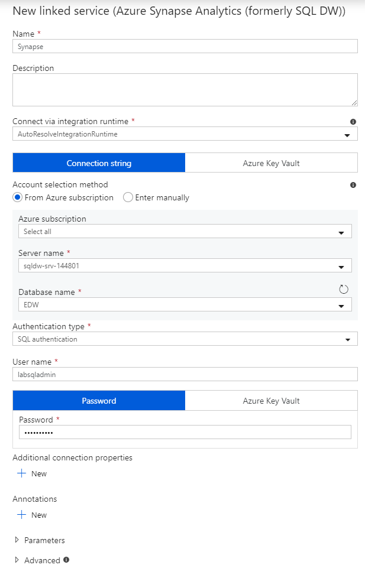

### Create an Azure Data Lake Storage Gen2 linked service

1. The last linked service needed for this lab is an Azure Data Lake Storage gen2.  In the connections tab, click **New**. Select the **Azure Data Lake Storage Gen2** tile and click continue.

    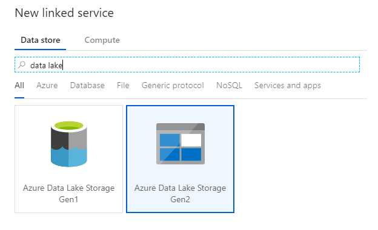
1. In the linked service configuration pane, enter 'ADLSGen2' as your linked service name. If you're using Account key authentication, select your adls gen2 storage account from the **Storage account name** dropdown. You can verify your connection information is correct by clicking **Test connection**. Click **Create** when finished.

    

### Turn on data flow debug mode

In section *Transform data using mapping data flow*, you will be building mapping data flows. A best practice before building mapping data flows is to turn on debug mode which allows you to test transformation logic in seconds on an active spark cluster.

To turn on debug, click the **Data flow debug** slider in the factory top bar. Click ok when the confirmation dialog pop-ups. The cluster will take about 5-7 minutes to start-up. Continue on to *Ingest data from Azure SQL DB into ADLS gen2 using the copy activity* while it is initializing.

## Ingest data from Azure SQL DB into ADLS gen2 using the copy activity

In this section, you will create a pipeline with a copy activity that ingests one table from a Azure SQL DB into an ADLS gen2 storage account. You will learn how to add a pipeline, configure a dataset and debug a pipeline via the ADF UX. The configuration pattern used in this section can be applies to copying from a relational data store to a file-based data store.

In Azure Data Factory, a pipeline is a logical grouping of activities that together perform a task. An activity defines an operation to perform on your data. A dataset points to the data you wish to use in a linked service.

### Create a pipeline with a copy activity

1. In the factory resources pane, click on the plus icon to open the new resource menu. Select **Pipeline**.

    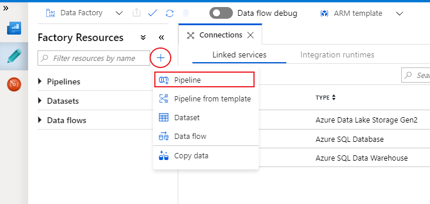
1. In the **General** tab of the pipeline canvas, name your pipeline something descriptive such as 'IngestAndTransformTaxiData'.

    
1. In the activities pane of the pipeline canvas, open the **Move and Transform** accordion and drag the **Copy data** activity onto the canvas. Give the copy activity a descriptive name such as 'IngestIntoADLS'.

    

### Configure Azure SQL DB source dataset

1. Click on the **Source** tab of the copy activity. To create a new dataset, click **New**. Your source will be the table 'dbo.TripData' located in the linked service 'SQLDB' configured earlier.

    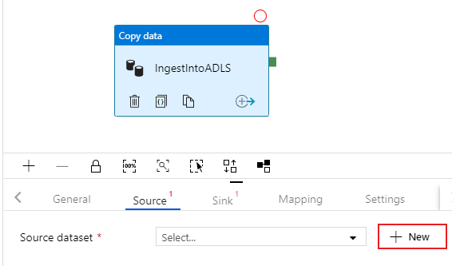
1. Search for **Azure SQL Database** and click continue.

    
1. Call your dataset 'TripData'. Select 'SQLDB' as your linked service. Select table name 'dbo.TripData' from the table name dropdown. Import the schema **From connection/store**. Click OK when finished.

    

You have successfully created your source dataset. Make sure in the source settings, the default value **Table** is selected in the use query field.

### Configure ADLS Gen 2 sink dataset

1. Click on the **Sink** tab of the copy activity. To create a new dataset, click **New**.

    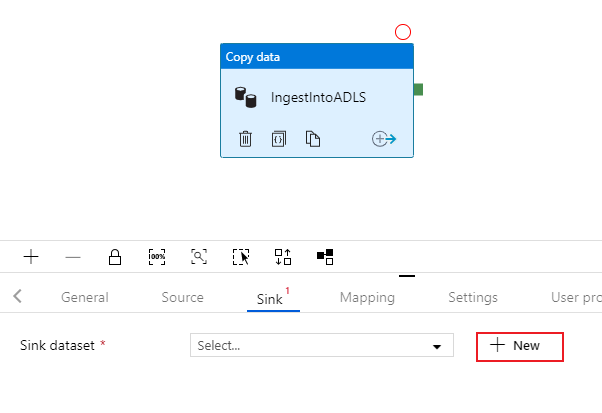
1. Search for **Azure Data Lake Storage Gen2** and click continue.

    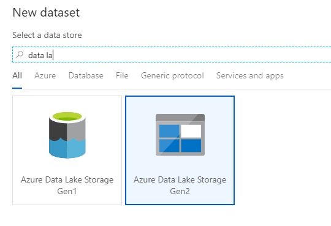
1. In the select format pane, select **DelimitedText** as you are writing to a csv file. Click continue.

    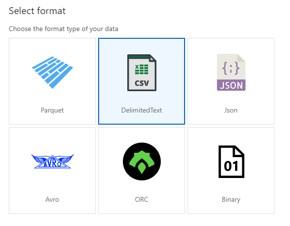
1. Name your sink dataset 'TripDataCSV'. Select 'ADLSGen2' as your linked service. Enter where you want to write your csv file. For example, you can write your data to file `trip-data.csv` in container `staging-container`. Set **First row as header** to true as you want your output data to have headers. Since no file exists in the destination yet, set **Import schema** to **None**. Click OK when finished.

    

### Test the copy activity with a pipeline debug run

1. To verify your copy activity is working correctly, click **Debug** at the top of the pipeline canvas to execute a debug run. A debug run allows you to test your pipeline either end-to-end or until a breakpoint before publishing it to the data factory service.

    
1. To monitor your debug run, go to the **Output** tab of the pipeline canvas. The monitoring screen will auto-refresh every 20 seconds or when you manually click the refresh button. The copy activity has a special monitoring view which can be access by clicking the eye-glasses icon in the **Actions** column.

    
1. The copy monitoring view gives the activity's execution details and performance characteristics. You can see information such as data read/written, rows read/written, files read/written, and throughput. If you have configured everything correctly, you should see 49,999 rows written into one file in your ADLS sink.

    
1. Before moving on to the next section, its suggested that you publish your changes to the data factory service by clicking **Publish all** in the factory top bar. While not covered in this lab, Azure Data Factory supports full git integration. Git integration allows for version control, iterative saving in a repository, and collaboration on a data factory. For more information, see [source control in Azure Data Factory](https://docs.microsoft.com/azure/data-factory/source-control#troubleshooting-git-integration).

    

## Transform data using mapping data flow

Now that you have successfully copied data into Azure Data Lake Storage, it is time to join and aggregate that data into a data warehouse. We will use mapping data flow, Azure Data Factory's visually designed transformation service. Mapping data flows allow users to develop transformation logic code-free and execute them on spark clusters managed by the ADF service.

The data flow created in this step inner joins the 'TripDataCSV' dataset created in the previous section with a table 'dbo.TripFares' stored in 'SQLDB' based on four key columns. Then the data gets aggregated based upon column `payment_type` to calculate the average of certain fields and written in a SQL Data Warehouse table.

### Add a data flow activity to your pipeline

1. In the activities pane of the pipeline canvas, open the **Move and Transform** accordion and drag the **Data flow** activity onto the canvas.

    
1. In the side pane that opens, select **Create new data flow** and choose **Mapping data flow**. Click **OK**.

    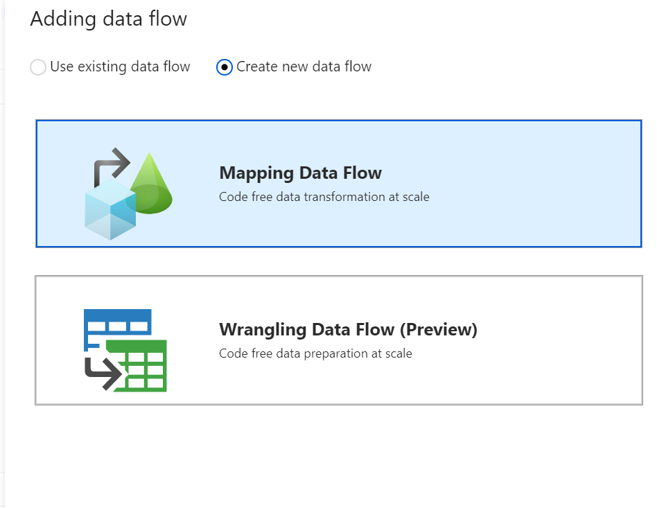
1. You'll be directed to the data flow canvas where you will be building your transformation logic. In the general tab, name your data flow 'JoinAndAggregateData'.

    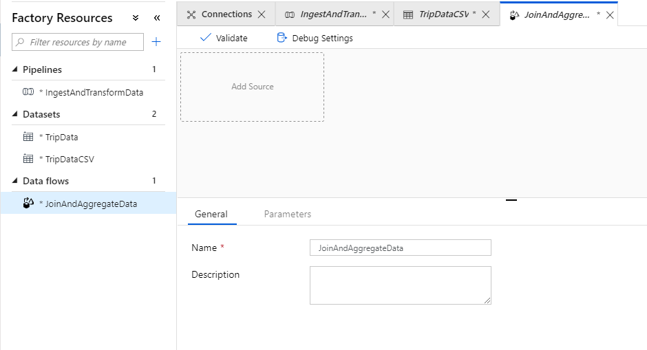

### Configure your trip data csv source

1. The first thing you want to do is configure your two source transformations. The first source will point to the 'TripDataCSV' DelimitedText dataset. To add a source transformation, click on the **Add Source** box in the canvas.

    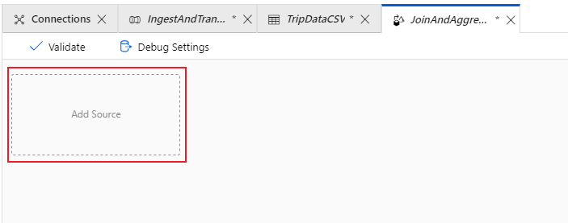
1. Name your source 'TripDataCSV' and select the 'TripDataCSV' dataset from the source drop-down. If you remember, you didn't import a schema initially when creating this dataset as there was no data there. Since `trip-data.csv` exists now, click **Edit** to go to the dataset settings tab.

    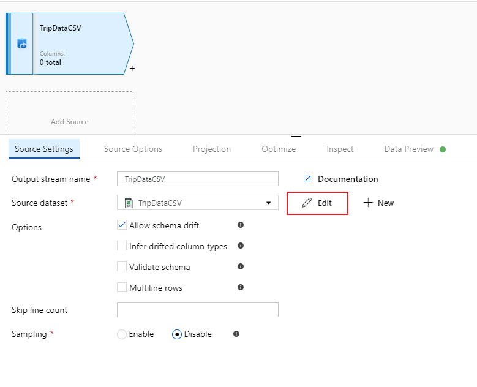
1. Go to tab **Schema** and click **Import schema**. Select **From connection/store** to import directly from the file store. Fourteen columns of type string should appear.

    
1. Go back to data flow 'JoinAndAggregateData'. If your debug cluster has started (indicated by a green circle next to the debug slider), you can get a snapshot of the data in the **Data Preview** tab. Click **Refresh** to fetch a data preview.

    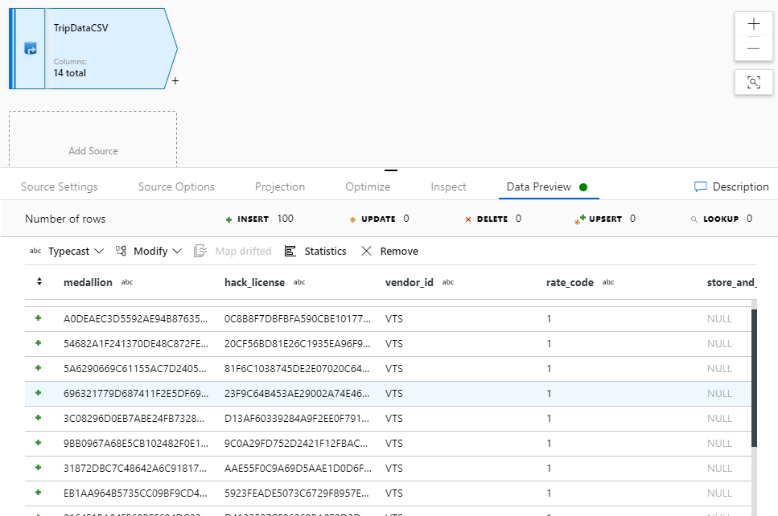

*Note: Data preview does not write data.*

### Configure your trip fares SQL DB source

1. The second source you're adding will point at the SQL DB table 'dbo.TripFares'. Under your 'TripDataCSV' source, there will be another **Add Source** box. Click it to add a new source transformation.

    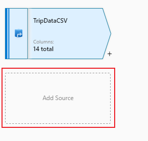
1. Name this source 'TripFaresSQL'. Click **New** next to the source dataset field to create a new SQL DB dataset.

    
1. Select the **Azure SQL Database** tile and click continue. *Note: You may notice many of the connectors in data factory are not supported in mapping data flow. To transform data from one of these sources, ingest it into a supported source using the copy activity*.

    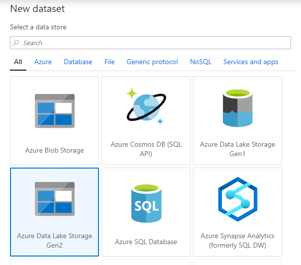
1. Call your dataset 'TripFares'. Select 'SQLDB' as your linked service. Select table name 'dbo.TripFares' from the table name dropdown. Import the schema **From connection/store**. Click OK when finished.

    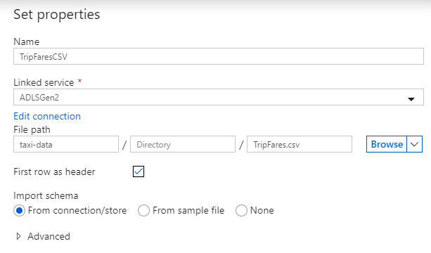
1. To verify your data, fetch a data preview in the **Data Preview** tab.

    

### Inner join TripDataCSV and TripFaresSQL

1. To add a new transformation, click the plus icon in the bottom-right corner of 'TripDataCSV'. Under **Multiple inputs/outputs**, select **Join**.

    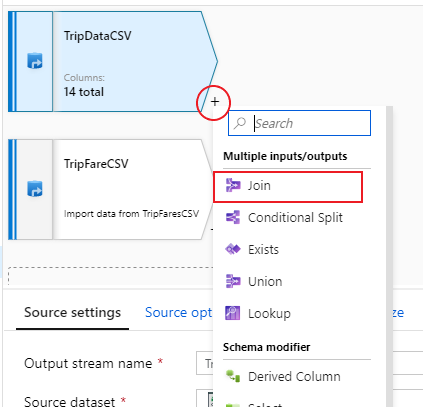
1. Name your join transformation 'InnerJoinWithTripFares'. Select 'TripFaresSQL' from the right stream dropdown. Select **Inner** as the join type. To learn more about the different join types in mapping data flow, see [join types](https://docs.microsoft.com/azure/data-factory/data-flow-join#join-types).

    Select which columns you wish to match on from each stream via the **Join conditions** dropdown. To add an additional join condition, click on the plus icon next to an existing condition. By default, all join conditions are combined with an AND operator which means all conditions must be met for a match. In this lab, we want to match on columns `medallion`, `hack_license`, `vendor_id`, and `pickup_datetime`

    
1. Verify you successfully joined 25 columns together with a data preview.

    

### Aggregate by payment_type

1. After you complete your join transformation, add an aggregate transformation by clicking the plus icon next to 'InnerJoinWithTripFares. Choose **Aggregate** under **Schema modifier**.

    
1. Name your aggregate transformation 'AggregateByPaymentType'. Select `payment_type` as the group by column.

    
1. Go to the **Aggregates** tab. Here, you will specify two aggregations:
    * The average fare grouped by payment type
    * The total trip distance grouped by payment type

    First, you will create the average fare expression. In the text box labeled **Add or select a column**, enter 'average_fare'.

    
1. To enter an aggregation expression, click the blue box labeled **Enter expression**. This will open up the data flow expression builder, a tool used to visually create data flow expressions using input schema, built-in functions and operations, and user-defined parameters. For more information on the capabilities of the expression builder, see the [expression builder documentation](https://docs.microsoft.com/azure/data-factory/concepts-data-flow-expression-builder).

    To get the average fare, use the `avg()` aggregation function to aggregate the `total_amount` column cast to an integer with `toInteger()`. In the data flow expression language, this is defined as `avg(toInteger(total_amount))`. Click **Save and finish** when you are done.

    
1. To add an additional aggregation expression, click on the plus icon next to `average_fare`. Select **Add column**.

    
1. In the text box labeled **Add or select a column**, enter 'total_trip_distance'. As in the last step, open the expression builder to enter in the expression.

    To get the total trip distance, use the `sum()` aggregation function to aggregate the `trip_distance` column cast to an integer with `toInteger()`. In the data flow expression language, this is defined as `sum(toInteger(trip_distance))`. Click **Save and finish** when you are done.

    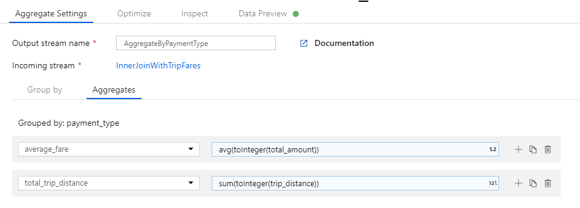
1. Test your transformation logic in the **Data Preview** tab. As you can see, there are significantly less rows and columns than previously. Only the three group by and aggregation columns defined in this transformation continue downstream. As there are only five payment type groups in the sample, only five rows are outputted.

    

### Configure you SQL DW sink

1. Now that we have finished our transformation logic, we are ready to sink our data in a Azure SQL DW table. Add a sink transformation under the **Destination** section.

    
1. Name your sink 'SQLDWSink'. Click **New** next to the sink dataset field to create a new SQL DW dataset.

    

1. Select the **Azure SQL Data Warehouse** tile and click continue.

    
1. Call your dataset 'AggregatedTaxiData'. Select 'SQLDW' as your linked service. Select **Create new table** and name the new table dbo.AggregateTaxiData. Click OK when finished

    
1. Go to the **Settings** tab of the sink. Since we are creating a new table, we need to select **Recreate table** under table action. Unselect **Enable staging** which toggles whether we are inserting row-by-row or in batch.

    

You have successfully created your data flow. Now its time to run it in a pipeline activity.

### Debug your pipeline end-to-end

1. Go back to the tab for the **IngestAndTransformData** pipeline. Notice the green box on the 'IngestIntoADLS' copy activity. Drag it over to the 'JoinAndAggregateData' data flow activity. This creates an 'on success' which causes the data flow activity to only run if the copy is successful.

    
1. As we did for the copy activity, click **Debug** to execute a debug run. For debug runs, the data flow activity will use the active debug cluster instead of spinning up a new cluster. This pipeline will take a little over a minute to execute.

    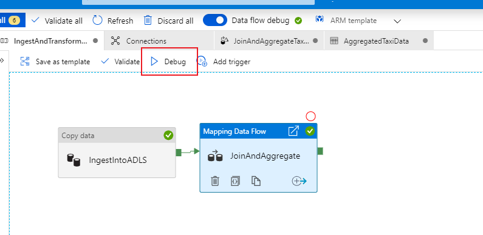
1. Like the copy activity, the data flow has a special monitoring view accessed by the eyeglasses icon on completion of the activity.

    
1. In the monitoring view, you can see a simplified data flow graph along with the execution times and rows at each execution stage. If done correctly, you should have aggregated 49,999 rows into 5 rows in this activity.

    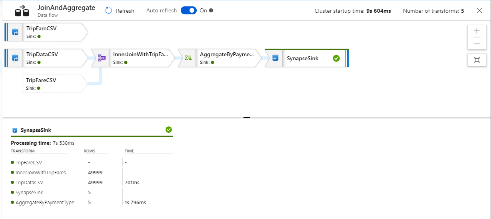
1. You can click a transformation to get additional details on its execution such as partitioning information and new/updated/dropped columns.

    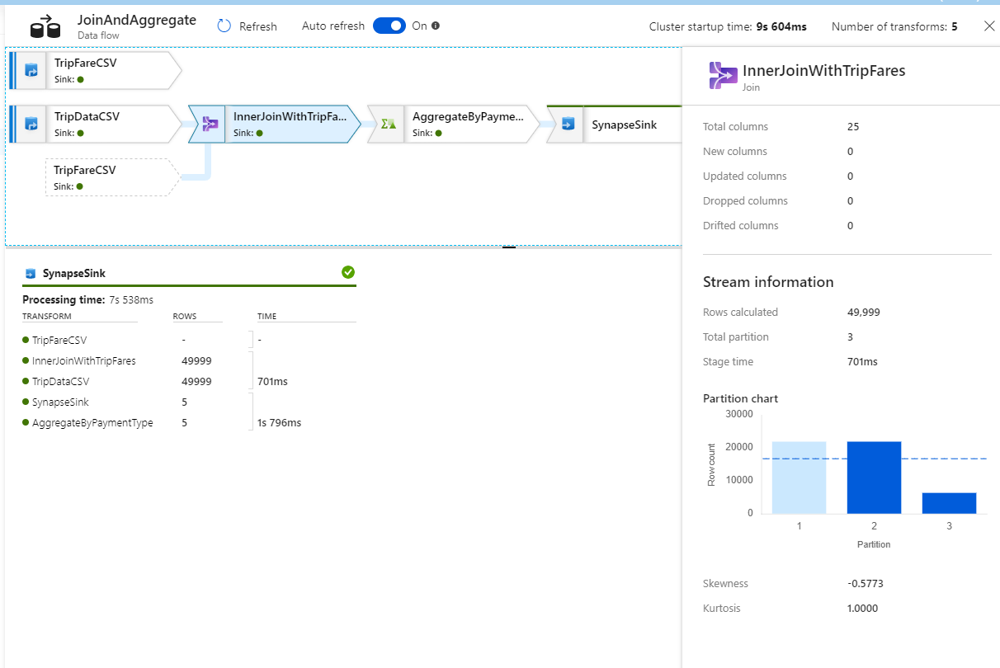

You have now completed the data factory portion of this lab. Publish your resources if you wish to operationalize them with triggers. You successfully ran a pipeline that ingested data from Azure SQL Database to Azure Data Lake Storage using the copy activity and then aggregated that data into an Azure SQL Data warehouse. You can verify the data was successfully written by looking at the SQL Server itself.

## Share data using Azure Data Share

In this section, you will learn how to set up a new data share using the Azure portal. This will involve creating a new data share which will contain datasets from Azure Data Lake Store Gen2 and Azure SQL Data Warehouse. You will then configure a snapshot schedule, which will give the data consumers an option to automatically refresh the data being shared with them. Then, you will invite recipients to your data share. 

Once you have created a data share, you will then switch hats and become the *data consumer*. As the data consumer, you will walk through the flow of accepting a data share invitation, configuring where you'd like the data to be received and mapping datasets to different storage locations. Then, you will trigger a snapshot which will copy the data shared with you into the destination specified. 

### Sharing data (Data Provider flow)

1. Open the Azure portal in either Microsoft Edge or Google Chrome.

1. Using the search bar at the top of the page, search for **Data Shares**

    

1. Select the data share account with 'Provider' in the name. For example, **DataProvider0102**. 

1. Select **Start sharing your data**

    

1. Select **+Create** to start configuring your new data share. 

1. Under **Share name**, specify a name of your choice. Note that this is the share name that will be seen by your data consumer, so be sure to give it a descriptive name such as TaxiData.

1. Under **Description**, put in a sentence which describes the contents of the data share. The data share will contain world wide taxi trip data which is stored in a number of stores including Azure SQL Data Warehouse and Azure Data Lake Store. 

1. Under **Terms of use**, specify a set of terms that you would like your data consumer to adhere to. Some examples include "Do not distribute this data outside your organization" or "Refer to legal agreement". 

    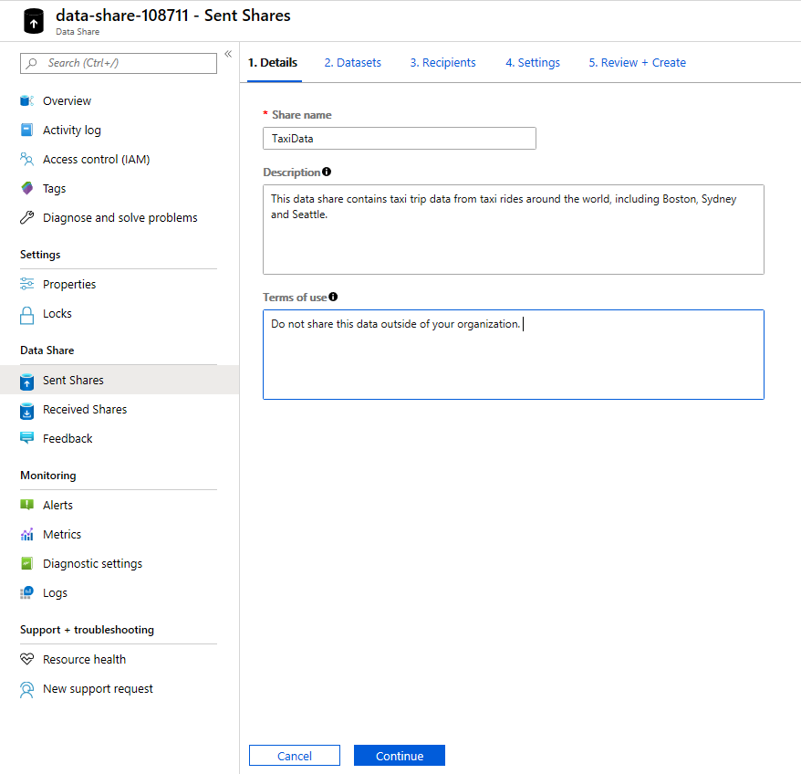

1. Select **Continue**. 

1. Select **Add datasets** 

    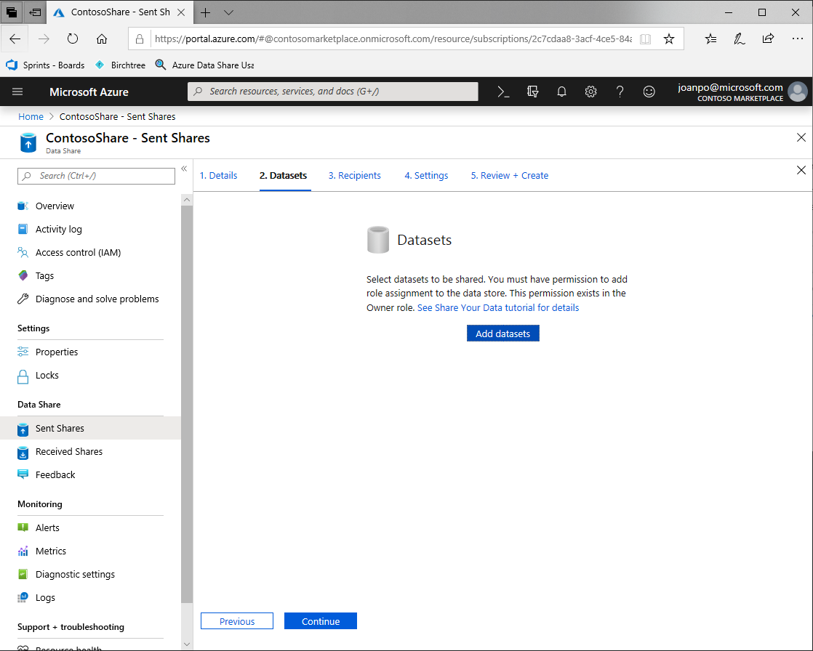

1. Select **Azure SQL Data Warehouse** to select a table from the Azure SQL Data Warehouse that your ADF transformations landed in. 

    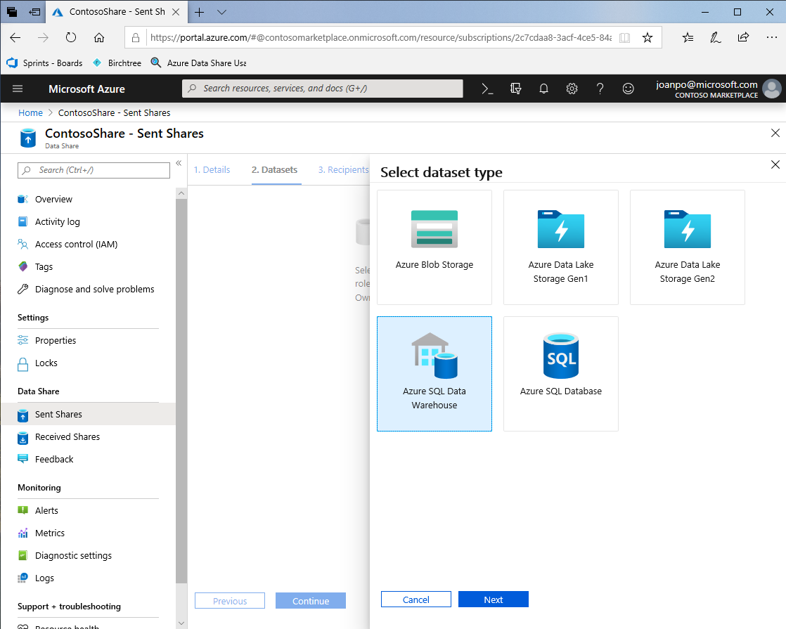
    
1. You will be given a script to run before you can proceed. The script provided creates a user in the SQL database to allow the Azure Data Share MSI to authenticate on it's behalf. 

    IMPORTANT: Before running the script, you must set yourself as the Active Directory Admin for the SQL Server. 

1. Open a new tab and navigate to the Azure portal. Copy the script provided to create a user in the database that you want to share data from. You must do this by logging into the EDW database using Query Explorer (preview) using AAD authentication. 

    You will need to modify the script so that the user created is contained within brackets. Eg:
    
    create user [dataprovider-xxxx] from external login; 
    exec sp_addrolemember db_owner, [dataprovider-xxxx];
    
1. Switch back to Azure Data Share where you were adding datasets to your data share. 

1. Select **EDW** for the SQL Data Warehouse, and select **AggregatedTaxiData** for the table. 

1. Select **Add dataset**

    We now have a SQL table that is part of our dataset. Next, we will add additional datasets from Azure Data Lake Store. 

1. Select **Add dataset** and select **Azure Data Lake Store Gen2**

    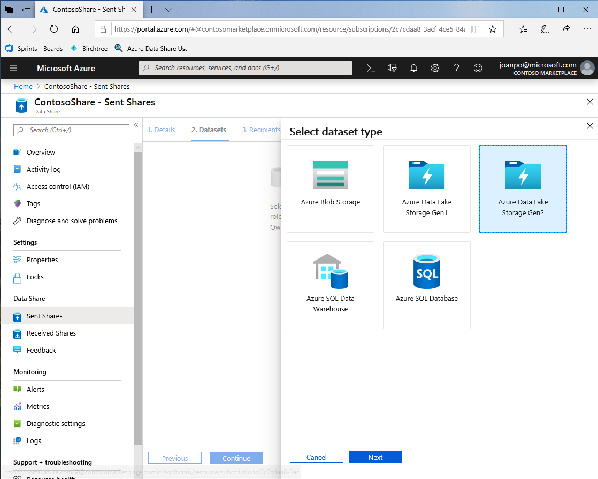

1. Select **Next**

1. Expand *wwtaxidata*. Expand *Boston Taxi Data*. Notice that you can share down to the file level. 

1. Select the *Boston Taxi Data* folder to add the entire folder to your data share. 

1. Select **Add datasets**

1. Review the datasets that have been added. You should have a SQL table and an ADLSGen2 folder added to your data share. 

1. Select **Continue**

1. In this screen, you can add recipients to your data share. The recipients you add will receive invitations to your data share. For the purpose of this lab, you must add in 2 e-mail addresses:

    1. The e-mail address of the Azure subscription you are in. 

        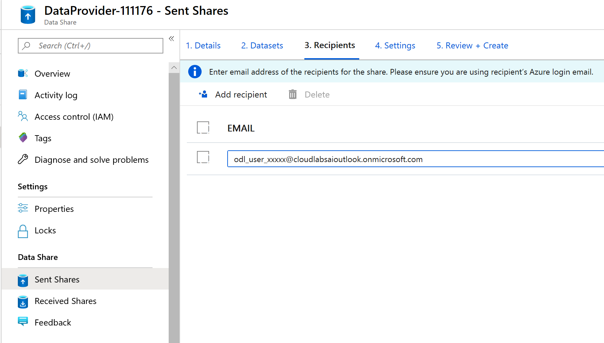

    1. Add in the fictional data consumer named *janedoe@fabrikam.com*.

1. In this screen, you can configure a Snapshot Setting for your data consumer. This will allow them to receive regular updates of your data at an interval defined by you. 

1. Check **Snapshot Schedule** and configure an hourly refresh of your data by using the *Recurrence* drop down.  

1. Select **Create**.

    You now have an active data share. Lets review what you can see as a data provider when you create a data share. 

1. Select the data share that you just created, titled **DataProvider**. You can navigate to it by selecting **Sent Shares** in **Data Share**. 

1. Click on Snapshot schedule, and note that you can disable the snapshot schedule if you choose. 

1. Next, select the **Datasets** tab. Note that you can add additional datasets to this data share after it has been created. 

1. Select the **Share subscriptions** tab. Note that no share subscriptions exist yet because your data consumer has not yet accepted your invitation.

1. Navigate to the **Invitations** tab. Here, you'll see a list of pending invitation(s). 

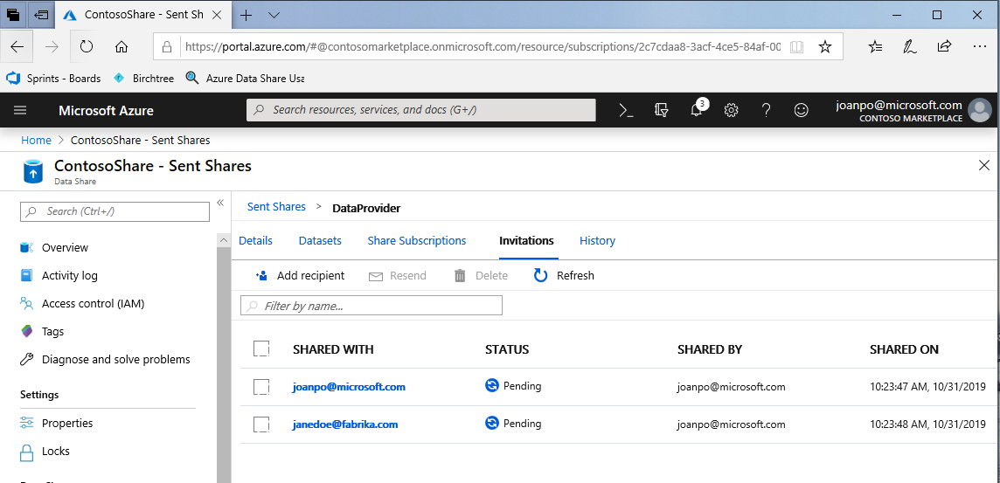

1. Select the invitation to *janedoe@fabrikam.com*. Select Delete. If your recipient has not yet accepted the invitation, they will no longer be able to do so. 

1. Select the **History** tab. Note that nothing is displayed as yet because your data consumer has not yet accepted your invitaiton and triggered a snapshot. 

### Receiving data (Data consumer flow)

Now that we have reviewed our data share, we are ready to switch context and wear our data consumer hat. 

You should now have an Azure Data Share invitation in your inbox from Microsoft Azure. Open the invitation and review the information. 

Once you are ready, click on "View invitation >". At this point, you are going to be simulating the data consumer experience when accepting a data providers invitation to their data share. 

You may be prompted to select a subscription. Make sure you select the subscription you have been working in for this lab. 

1. Click on the invitation titled *DataProvider*. 

1. In this Invitation screen, you'll notice various details about the data share that you configured earlier as a data provider. Review the details and accept the terms of use if provided.

1. Under Target Data Share Account, select the Subscription and Resouce Group that already exists for your lab. 

1. Next to **Data share account**, select **DataConsumer**. Note that you can also create a new data share account. 

1. Next to **Received share name**, you'll notice the default share name is the name that was specified by the data provider. Give the share a friendly name that describes the data you're about to receive, e.g **TaxiDataShare**.

1. Note that you can choose to **Accept and configure now** or **Accept and configure later**. If you choose to accept and configure now, you'll specify a storage account where all data should be copied. If you choose to accept and configure later, the datasets in the share will be ummapped and you'll need to manually map them. We will opt for th later. 

1. Select **Accept and configure later**. 

    In configuring this option, a share subscription is created but there is nowhere for the data to land since no destination has been mapped. 

    Next, we will configure dataset mappings for the data share. 

1. Select the Received Share (the name you specified in step 5).

    Note that **Trigger snapshot** is greyed out but the share is Active. 

1. Select the **Datasets** tab. Notice that each dataset is Unmapped, which means that it has no destination. 

1. Select the SQL Data Warehouse Table and then select **+ Map to Target**.

1. On the right hand side of the screen, select the **Target Data Type** drop down. 

    Note that you can map the SQL data to a wide range of data stores. In this case, we'll be mapping to an Azure SQL Database.
    
    (Optional) Select **Azure Data Lake Store Gen2** as the target data type. 
    
    (Optional) Select the Subscription, Resource Group and Storage account you have been working in. 
    
    (Optional) Note that you can choose to receive the data into your data lake in either csv or parquet format. 

1. Next to **Target data type**, select Azure SQL Database. 

1. Select the Subscription, Resource Group and Storage account you have been working in. 

1. Before you can proceed, you will need to create a new user in the SQL Server by running the script provided. First, copy the script provided to your clipboard. 

1. Open a new Azure portal tab. Do not close your existing tab as you will need to come back to it in a moment. 

1. In the new tab you opened, navigate to **SQL databases**.

1. Select the SQL database (there should only be one in your subscription). Be careful not to select the SQL Data Warehouse. 

1. Select **Query editor (preview)**

1. Use AAD authentication to log in to Query editor. 

1. Run the query provided in your data share. 

    This command allows the Azure Data Share service to use Managed Identites for Azure Services to authenticate to the SQL Server to be able to copy data into it. 

1. Go back to the original tab, and select **Map to target**.

1. Next, select the Azure Data Lake Gen2 folder that is part of the dataset and map to an existing storage account. 

    With all datasets mapped, you are now ready to start receiving data from the data provider. 
    
1. Select **Details**. 

    Notice that **Trigger snapshot** is no longer greyed out, since the data share now has destinations to copy into.

1. Select Trigger snapshot -> Full Copy. 

    This will start copying data into your new data share account. In a real world scenario, this data would be coming from a third party. 

    It will take approximately 3-5 minutes for the data to come across. You can monitor progress by clicking on the **History** tab. 

    While you wait, navigate to the original data share (DataProvider) and view the status of the **Share Subscriptions** and **History** tab. Notice that there is now an active subscription, and as a data provider, you can also monitor when the data consumer has started to receive the data shared with them. 

1. Navigate back to the Data consumer's data share. Once the status of the trigger is successful, navigate to the destination SQL database and data lake to see that the data has landed in the respective stores. 

Congratulations, you have reached the end of the lab. 

