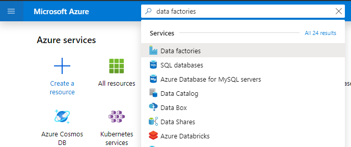
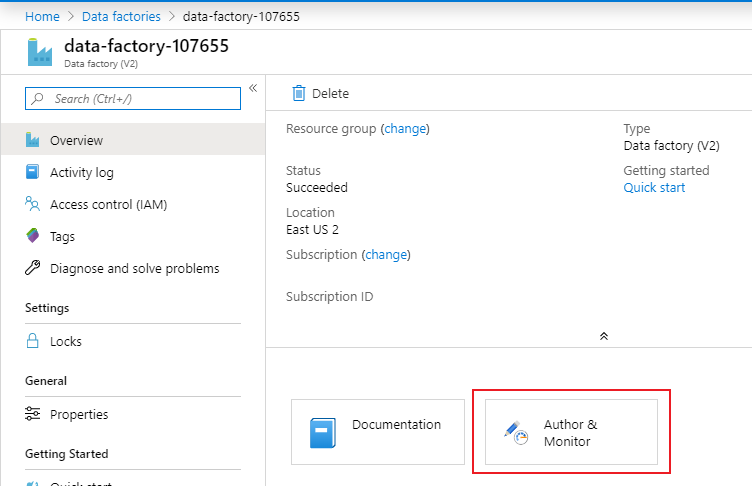
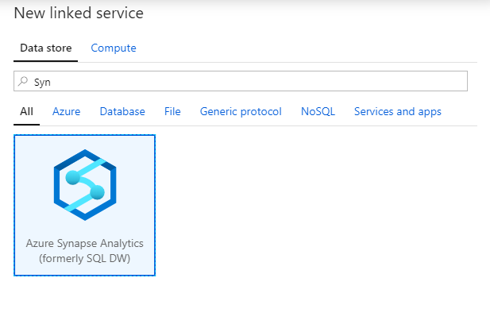
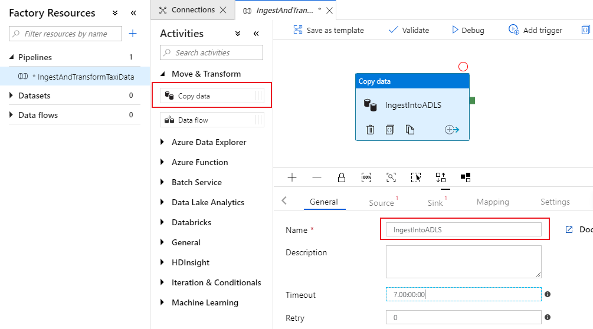
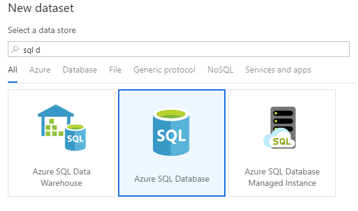
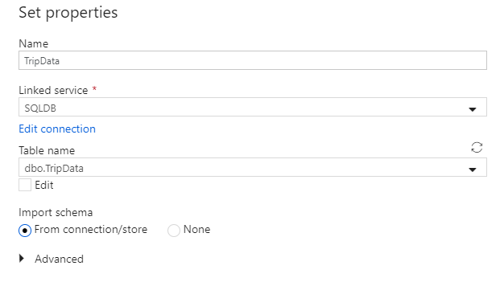

# Data integration using Azure Data Factory and Azure Data Share

As customers embark on their modern data warehouse and analytics projects, they require not only more data but also more visibility into their data across their data estate. This workshop dives into how improvements to Azure Data Factory and Azure Data Share simplify data integration and management in Azure. From enabling code-free ETL/ELT to creating a comprehensive view over your data, improvements in Azure Data Factory will empower your data engineers to confidently bring in more data, and thus more value, to your enterprise. Also, learn about Azure Data Share and how you can do B2B sharing in a governed manner.

In this workshop, you will use Azure Data Factory (ADF) to ingest data from an Azure SQL database (SQL DB) into Azure Data Lake Storage gen2 (ADLS gen2). Once you land the data in the lake, you will transform it via mapping data flows, data factory's native transformation service, and sink it into Azure SQL data warehouse (SQL DW).

The data used in this lab is New York City taxi data. To import it into your Azure SQL database, download the [taxi-data bacpac file](https://github.com/djpmsft/ADF_Labs/blob/master/sample-data/taxi-data.bacpac).

## Prerequisites

* **Azure subscription**: If you don't have an Azure subscription, create a [free account](https://azure.microsoft.com/free/) before you begin.

* **Azure SQL Database**: If you don't have a SQL DW, learn how to [create a SQL DW account](https://docs.microsoft.com/azure/sql-database/sql-database-single-database-get-started?tabs=azure-portal)

* **Azure Data Lake Storage Gen2 storage account**: If you don't have an ADLS Gen2 storage account, learn how to [create an ADLS Gen2 storage account](https://docs.microsoft.com/azure/storage/blobs/data-lake-storage-quickstart-create-account).

* **Azure SQL Data Warehouse**: If you don't have a SQL DW, learn [create a SQL DW account](https://docs.microsoft.com/azure/sql-data-warehouse/create-data-warehouse-portal).

* **Azure Data Factory**: If you have not created a data factory, see how to [create a data factory](https://docs.microsoft.com/azure/data-factory/quickstart-create-data-factory-portal).

## Set up your Azure Data Factory environment

In this section, you will learn how to access the Azure Data Factory user experience (ADF UX) from the Azure portal. Once in the ADF UX, you will configure three linked service for each of the data stores we are using: Azure SQL DB, ADLS Gen2, and Azure SQL DW.

In Azure Data Factory, linked services define the connection information to external resources. Azure Data Factory currently supports over 85 connectors.

### Open the Azure Data Factory UX

1. Open the [Azure portal](https://portal.azure.com) in either Microsoft Edge or Google Chrome.
1. Using the search bar at the top of the page, search for 'Data Factories'

    
1. Click on your data factory resource to open up its resource blade.

    
1. Click on **Author and Monitor** to open up the ADF UX. The ADF UX can also be accessed at adf.azure.com.

    
1. You will be redirected to the homepage of the ADF UX. This page contains quick-starts, instructional videos and links to tutorials to learn data factory concepts. To start authoring, click on the pencil icon in left side-bar.

    

### Create an Azure SQL database linked service

1. The authoring page is where you create data factory resources such as pipelines, datasets, data flows, triggers and linked services. To create a linked service, click on the **Connections** button in the bottom-right corner.

    
1. In the connections tab, click **New** to add a new linked service.

    
1. The first linked service you will configure is an Azure SQL DB. You can use the search bar to filter the data store list. Click on the **Azure SQL Database** tile and click continue.

    
1. In the SQL DB configuration pane, enter 'SQLDB' as your linked service name. Enter in your credentials to allow data factory to connect to your database. If you're using SQL authentication, enter in the server name, the database, your user name and password. You can verify your connection information is correct by clicking **Test connection**. Click **Create** when finished.

    

### Create an Azure SQL data warehouse linked service

1. Repeat the same process to add an Azure SQL DW linked service. In the connections tab, click **New**. Select the **Azure SQL Data Warehouse** tile and click continue.

    
1. In the linked service configuration pane, enter 'SQLDW' as your linked service name. Enter in your credentials to allow data factory to connect to your database. If you're using SQL authentication, enter in the server name, the database, your user name and password. You can verify your connection information is correct by clicking **Test connection**. Click **Create** when finished.

    

### Create an Azure Data Lake Storage Gen2 linked service

1. The last linked service needed for this lab is an Azure Data Lake Storage gen2.  In the connections tab, click **New**. Select the **Azure Data Lake Storage Gen2** tile and click continue.

    
1. In the linked service configuration pane, enter 'ADLSGen2' as your linked service name. If you're using Account key authentication, select your adls gen2 storage account from the **Storage account name** dropdown. You can verify your connection information is correct by clicking **Test connection**. Click **Create** when finished.

    

### Turn on data flow debug mode

In section *Transform data using mapping data flow*, you will be building mapping data flows. A best practice before building mapping data flows is to turn on debug mode which allows you to test transformation logic in seconds on an active spark cluster.

To turn on debug, click the **Data flow debug** slider in the factory top bar. Click ok when the confirmation dialog pop-ups. The cluster will take about 5-7 minutes to start-up. Continue on to *Ingest data from Azure SQL DB into ADLS gen2 using the copy activity* while it is initializing.

## Ingest data from Azure SQL DB into ADLS gen2 using the copy activity

In this section, you will create a pipeline with a copy activity that ingests one table from a Azure SQL DB into an ADLS gen2 storage account. You will learn how to add a pipeline, configure a dataset and debug a pipeline via the ADF UX. The configuration pattern used in this section can be applies to copying from a relational data store to a file-based data store.

In Azure Data Factory, a pipeline is a logical grouping of activities that together perform a task. An activity defines an operation to perform on your data. A dataset points to the data you wish to use in a linked service.

### Create a pipeline with a copy activity

1. In the factory resources pane, click on the plus icon to open the new resource menu. Select **Pipeline**.

    
1. In the **General** tab of the pipeline canvas, name your pipeline something descriptive such as 'IngestAndTransformTaxiData'.

    
1. In the activities pane of the pipeline canvas, open the **Move and Transform** accordion and drag the **Copy data** activity onto the canvas. Give the copy activity a descriptive name such as 'IngestIntoADLS'.

    

### Configure Azure SQL DB source dataset

1. Click on the **Source** tab of the copy activity. To create a new dataset, click **New**. Your source will be the table 'dbo.TripData' located in the linked service 'SQLDB' configured earlier.

    
1. Search for **Azure SQL Database** and click continue.

    
1. Call your dataset 'TripData'. Select 'SQLDB' as your linked service. Select table name 'dbo.TripData' from the table name dropdown. Import the schema **From connection/store**. Click OK when finished.

    

You have successfully created your source dataset. Make sure in the source settings, the default value **Table** is selected in the use query field.

### Configure ADLS Gen 2 sink dataset

1. Click on the **Sink** tab of the copy activity. To create a new dataset, click **New**.

    
1. Search for **Azure Data Lake Storage Gen2** and click continue.

    
1. In the select format pane, select **DelimitedText** as you are writing to a csv file. Click continue.

    
1. Name your sink dataset 'TripFaresCSV'. Select 'ADLSGen2' as your linked service. Enter where you want to write your csv file. For example, you can write your data to file `trip-fares.csv` in container `staging-container`. Set **First row as header** to true as you want your output data to have headers. Since no file exists in the destination yet, set **Import schema** to **None**. Click OK when finished.

    

## Transform data from ADLS into SQL DW

## Share data
