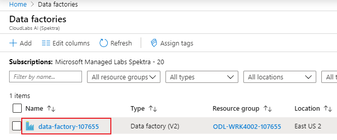
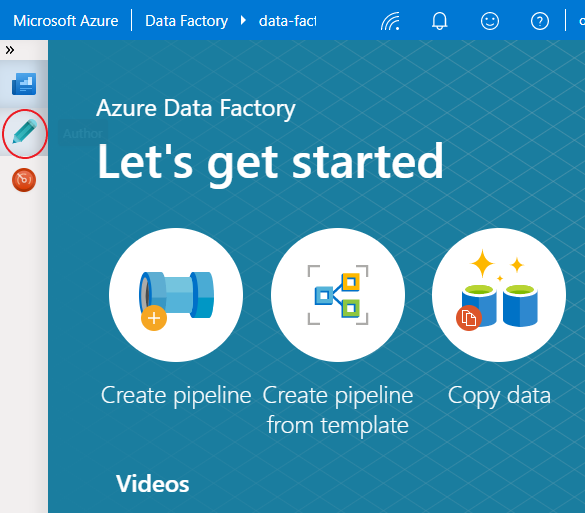
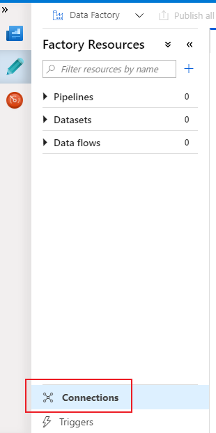
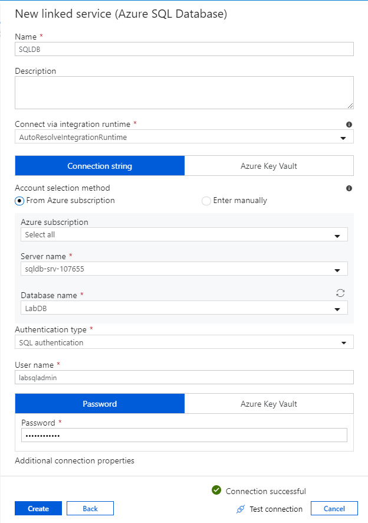

# Data integration using Azure Data Factory and Azure Data Share

As customers embark on their modern data warehouse and analytics projects, they require not only more data but also more visibility into their data across their data estate. This workshop dives into how improvements to Azure Data Factory and Azure Data Share simplify data integration and management in Azure. From enabling code-free ETL/ELT to creating a comprehensive view over your data, improvements in Azure Data Factory will empower your data engineers to confidently bring in more data, and thus more value, to your enterprise. Also, learn about Azure Data Share and how you can do B2B sharing in a governed manner.

In this workshop, you will use Azure Data Factory (ADF) to ingest data from an Azure SQL database (SQL DB) into Azure Data Lake Storage gen2 (ADLS gen2). Once you land the data in the lake, you will transform it via mapping data flows, data factory's native transformation service, and sink it into Azure SQL data warehouse (SQL DW).

The data used in this lab is New York City taxi data. To import it into your Azure SQL database, download the [taxi-data bacpac file](https://github.com/djpmsft/ADF_Labs/blob/master/sample-data/taxi-data.bacpac).

## Prerequisites

* **Azure subscription**: If you don't have an Azure subscription, create a [free account](https://azure.microsoft.com/free/) before you begin.

* **Azure SQL Database**: If you don't have a SQL DW, learn how to [create a SQL DW account](https://docs.microsoft.com/azure/sql-database/sql-database-single-database-get-started?tabs=azure-portal)

* **Azure Data Lake Storage Gen2 storage account**: If you don't have an ADLS Gen2 storage account, learn how to [create an ADLS Gen2 storage account](https://docs.microsoft.com/azure/storage/blobs/data-lake-storage-quickstart-create-account).

* **Azure SQL Data Warehouse**: If you don't have a SQL DW, learn [create a SQL DW account](https://docs.microsoft.com/azure/sql-data-warehouse/create-data-warehouse-portal).

* **Azure Data Factory**: If you have not created a data factory, see how to [create a data factory](https://docs.microsoft.com/azure/data-factory/quickstart-create-data-factory-portal).

## Set up Azure Data Factory environment

In this section, you will learn how to access the Azure Data Factory user experience (ADF UX) from the Azure portal. Once in the ADF UX, you will configure three linked service for each of the data stores we are using: Azure SQL DB, ADLS Gen2, and Azure SQL DW. In Azure Data Factory, linked services define the connection information to external resources. Azure Data Factory currently supports over 85 connectors.

### Opening the Azure Data Factory UX

1. Open the [Azure portal](https://portal.azure.com) in either Microsoft Edge or Google Chrome.
1. Using the search bar at the top of the page, search for 'Data Factories'

    
1. Click on your data factory resource to open up its resource blade.

    
1. Click on **Author and Monitor** to open up the ADF UX. The ADF UX can also be accessed at adf.azure.com.

    
1. You will be redirected to the homepage of the ADF UX. This page contains quick-starts, instructional videos and links to tutorials to learn data factory concepts. To start authoring, click on the pencil icon in left side-bar.

### Create an Azure SQL database linked service

    
1. The authoring page is where you create data factory resources such as pipelines, datasets, data flows, triggers and linked services. To create a linked service, click on the **Connections** button in the bottom-right corner.

    
1. In the connections tab, click **New** to add a new linked service.

    
1. The first linked service you will configure is an Azure SQL DB. You can use the search bar to filter the data store list. Click on the **Azure SQL Database** tile and click continue.

    
1. In the SQL DB configuration pane, enter 'SQLDB' as your linked service name. Enter in your credentials to allow data factory to connect to your database. If you're using SQL authentication, enter in the server name, the database, your user name and password. You can verify your connection information is correct by clicking **Test connection**. Click **Create** when finished.

    
### Create an Azure SQL data warehouse linked service

1. Repeat the same process to add an Azure SQL DW linked service. In the connections tab, click **New**. Select the **Azure SQL Data Warehouse** tile and click continue.

    
1. In the linked service configuration pane, enter 'SQLDW' as your linked service name. Enter in your credentials to allow data factory to connect to your database. If you're using SQL authentication, enter in the server name, the database, your user name and password. You can verify your connection information is correct by clicking **Test connection**. Click **Create** when finished.

    
### Create an Azure Data Lake Gen2 linked service

1. The last linked service needed for this lab is an Azure Data Lake Storage gen2.  In the connections tab, click **New**. Select the **Azure Data Lake Storage Gen2** tile and click continue.

    
1. 

## Ingest data from SQL DB to ADLS

## Transform data from ADLS into SQL DW

## Share data
