# Movies Analytics using Azure Data Factory

*If you're new to Azure Data Factory, see [Introduction to Azure Data Factory](https://docs.microsoft.com/azure/data-factory/introduction).*

In this Lab, you will utilize Azure Data Factory's visual authoring experience to create a pipeline that copies movie data stored in Amazon S3 to Azure Data Lake Storage Gen2 and then executes a Mapping Data Flow to transform and write the data to a SQL Data Warehouse. If a S3 instance is not available, this lab can also be done by querying the data via a HTTP request.

The pipeline created in this lab is available via the Azure Data Factory [Template Gallery](https://azure.microsoft.com/blog/get-started-quickly-using-templates-in-azure-data-factory/) under the name **Movie Analytics**

Please allot about two hours to complete this lab end to end.

## Prerequisites

* **Azure subscription**: If you don't have an Azure subscription, create
    a [free account](https://azure.microsoft.com/free/) before you begin.

* **Azure Data Lake Storage Gen2 storage account**: If you don't have an ADLS
    Gen2 storage account, see the instructions in [Create an ADLS Gen2 storage
    account](https://docs.microsoft.com/en-us/azure/storage/blobs/data-lake-storage-quickstart-create-account).

* **Azure SQL Database account**: If you don't have a SQL DB account, see the instructions in [Create a SQL DB
    account](https://docs.microsoft.com/en-us/azure/sql-database/sql-database-single-database-get-started?tabs=azure-portal).

## Setting up your environment

**Create your data factory:** Use the [Azure Portal](https://portal.azure.com) to create your Data Factory. Detailed instructions can be found at [Create a Data Factory](https://docs.microsoft.com/azure/data-factory/quickstart-create-data-factory-portal).

1. Once in the Azure Portal, click on the **All Services** button on the left hand-side and select "Data Factories" in the Analytics section.
    

1. Click **Add** to open the Data Factory creation screen
    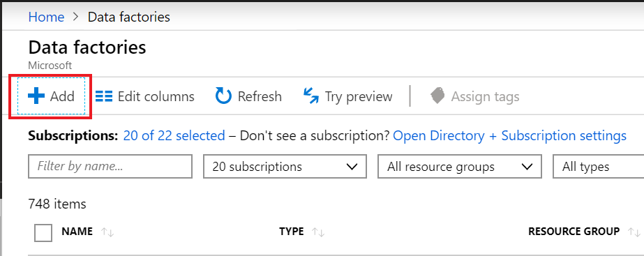

1. Specify your Data Factory configuration settings in the creation pane. Choose a globally unique data factory name and select your subscription, resource group, and region. Your data factory must be version V2. Once you are done, click **Create**. Your data factory may take a couple minutes to deploy.
    * Mapping Data Flow is not currently available in the following data factory regions: West Central US, Brazil South, Korea Central and France Central. For the purposes of this lab, please do not create your data factory in one of these reasons. 
    * ADF's integration with Azure DevOps and Github will not be covered in this lab. To enable this feature, check **Enable Git** and specify your configuration information. See [Source Control in Azure Data Factory](https://docs.microsoft.com/azure/data-factory/source-control#troubleshooting-git-integration).
    

1. Once your data factory is deployed, go to the resource and click on **Authoring and Monitoring** to open the ADF user experience (UX). You can access the UX via adf.azure.com.
    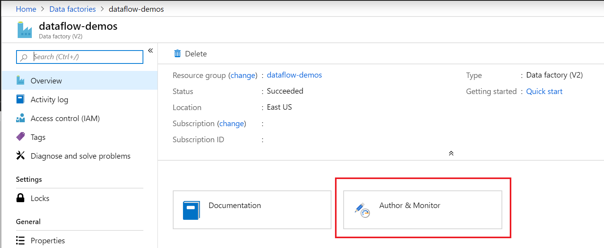
  
## Ingesting data into Azure Data Lake Storage Gen2
  
Once your data factory is created and you open the ADF UX, the first step in your pipeline is creating a Copy Activity that copies the moviesDB.csv file from S3 or GitHub to ADLS Gen2 storage.

1. **Open the authoring canvas** If coming from the ADF homepage, click on the pencil icon on the left sidebar or the create pipeline button to open the authoring canvas.
    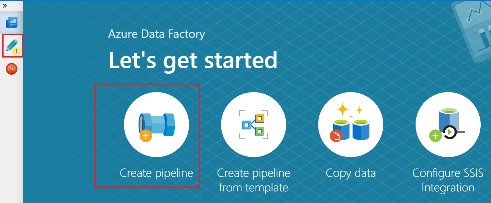
1. **Create the pipeline** Click on the + button in the Factory Resources pane and select Pipeline
    
1. **Add a copy activity** In the Activities pane, open the Move and Transform accordion and drag the Copy Data activity onto the pipeline canvas
    k 'Preview Data' in the Source tab of the copy activity to get a small snapshot of your data.
    
1. **Create a new HTTP dataset to use as a source**
    1. In the Source tab of the Copy activity settings, click '+ New'
    
    1. In the data store list, select the HTTP tile and click continue
    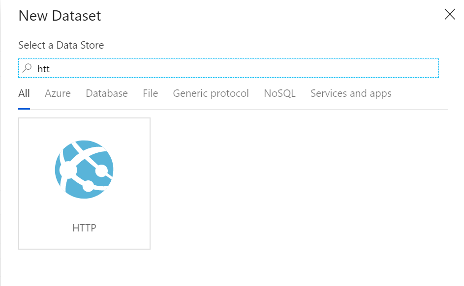
    1. In the file format list, select the DelimitedText format tile and click continue
    
    1. In Set Properties sidenav, give your dataset an understandable name and click on the Linked Service dropdown. If you have not created your HTTP Linked Service, select 'New'.
    
    1. In the HTTP Linked Service configuration pane, specify the url of the moviesDB csv file. You can access the data with no authentication required using the following endpoint:

    https://raw.githubusercontent.com/djpmsft/adf-ready-demo/master/moviesDB.csv

    
    a. Once you have created and selected the linked service, specify the rest of your dataset settings. These settings specify how and where in your connection we want to pull the data. As the url is pointed at the file already, no relative endpoint is required. As the data has a header in the first row, set 'First row as header' to be true and select Import schema from connection/store to pull the schema from the file itself. Select Get as the request method. Click 'Finish' once completed.
    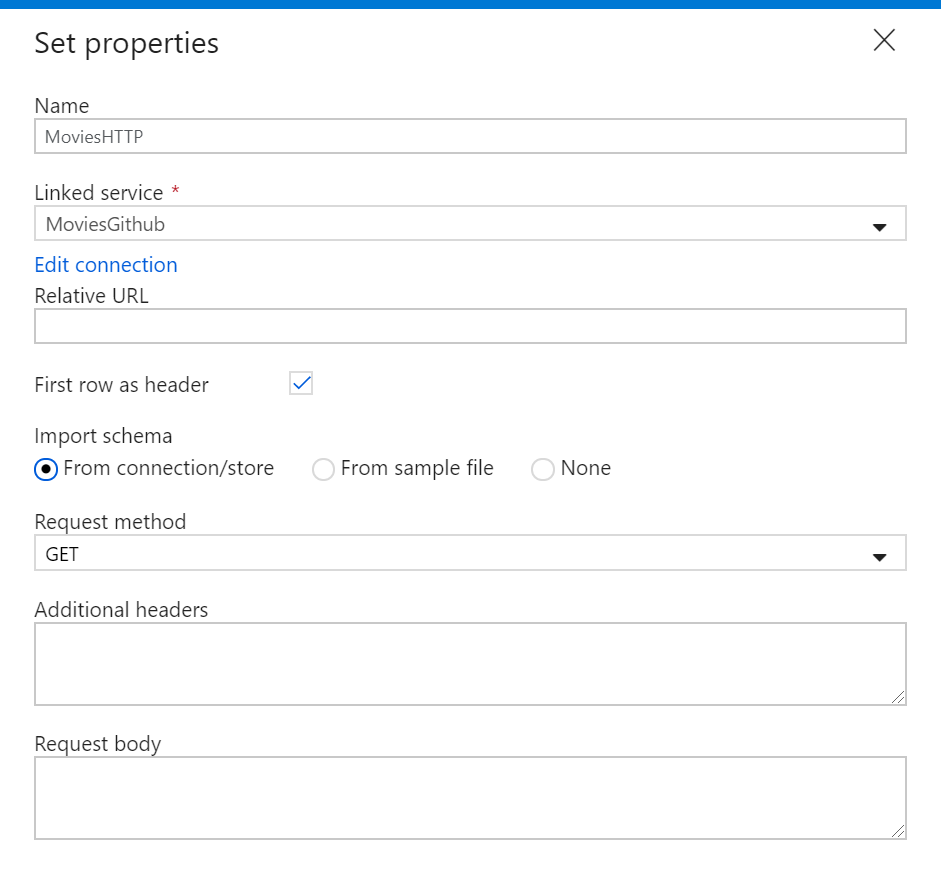
    a. To verify your dataset is configured correctly, click 'Preview Data' in the Source tab of the copy activity to get a small snapshot of your data.
    
1. **Create a new ADLS Gen2 dataset sink**
    1. In the Sink tab, click + New
    
    1. Select the Azure Data lake Storage Gen2 tile and click continue
    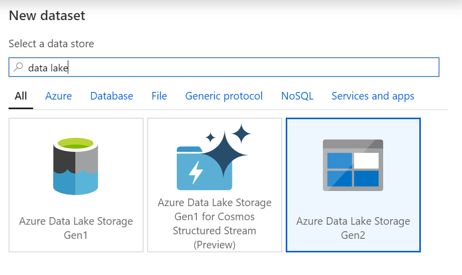
    1. Select the DelimitedText format tile and click continue
    
    1. In Set Properties sidenav, give your dataset an understandable name and click on the Linked Service dropdown. If you have not created your ADLS Linked Service, select 'New'.
    
    1. In the ADLS linked service configuration pane, select your authentication method and enter your credentials. In the example below, I used account key and selected my storage account from the drop down.
    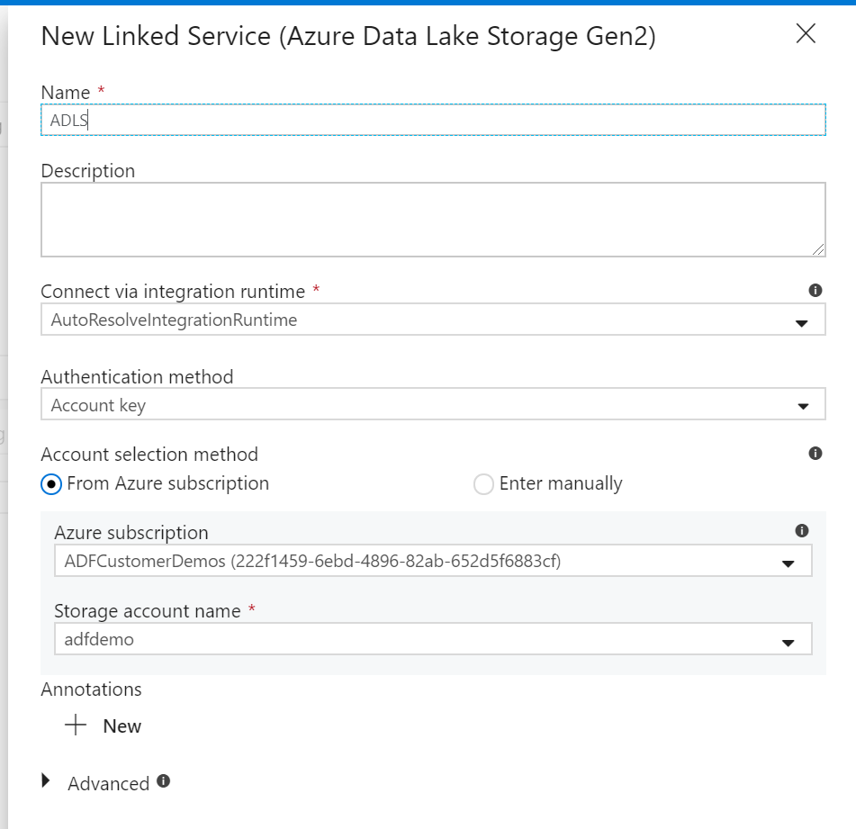
    1. Once you have configured your linked service, enter in the ADLS dataset configuration. As you are writing to this dataset, you want to point the folder and file where you want moviesDB.csv copied to. In the example below, I am writing to the file 'moviesDB.csv' in the folder 'output' in the container 'sample-data'. While the folder and file can be dynamically created, the container must exist prior to writing to it. Set First row as header to be true. If you do not specify this setting, your data will be written without a header which can provide issues later in the lab. Do not specify a schema at this time. Click finish once completed.
    

At this point, you have fully configured your copy activity. To test it out, click on the Debug button at the top of the pipeline canvas. This will start a pipeline debug run.

To monitor the progress of a pipeline debug run, click on the Output tab of the pipeline

To view a more detailed description of the activity output, click on the eyeglasses icon. This will open up the copy monitoring screen which provides useful metrics such as Data read/written, throughput and in-depth duration statistics.

To verify the copy worked as expected, open up your ADLS gen2 storage account and check to see your file was written as expected

## Transforming Data with Mapping Data Flow

Now that you have moved the data into ADLS, you are ready to build a Mapping Data Flow which will transform your data at scale via a spark cluster and then load it into a Data Warehouse. For more information on Mapping Data Flows, see the [Mapping Data Flow documentation](https://docs.microsoft.com/azure/data-factory/concepts-data-flow-overview).

1. **Turn on Data Flow Debug** Turn the Data Flow Debug slider located at the top of the authoring module on. Data Flow clusters take 5-7 minutes to warm up and users are recommended to turn on debug first if they plan to do Data Flow development. For more information, see [Debug Mode](https://docs.microsoft.com/azure/data-factory/concepts-data-flow-debug-mode)
    
1. **Add a Data Flow activity** In the Activities pane, open the Move and Transform accordion and drag the Data Flow activity onto the pipeline canvas. In the sidenav that pops up, select Create new Data Flow and select Mapping Data Flow. Go back to the pipeline canvas and drag the green box from your Copy activity to the Data Flow Activity to create an on success condition.
    
1. **Add an ADLS source** Open the Data Flow canvas. Click on the Add Source button in the Data Flow canvas. In the source dataset dropdown, select your ADLS Gen2 dataset used in your Copy activity
    
    * If your dataset is pointing at a folder with other files, you may need to create another dataset or utilize parameterization to make sure only the moviesDB.csv file is read
    * If you have not imported your schema in your ADLS, but have already ingested your data, go to the dataset's 'Schema' tab and click 'Import schema' so that your data flow knows the schema projection.

    Once your debug cluster is warmed up, verify your data is loaded correctly via the Data Preview tab. Once you click the refresh button, Mapping Data Flow will show calculate a snapshot of what your data looks like when it is at each transformation.
    

1. **Add a Select transformation to rename and drop a column** You may have noticed that the Rotton Tomatoes column is misspelled. To correctly name it and drop the unused Rating column, you can add a [Select transformation](https://docs.microsoft.com/azure/data-factory/data-flow-select) by clicking on the + icon next to your ADLS source node and choosing Select under Schema modifier.
    

    In the Name as field, change 'Rotton' to 'Rotten'. To drop the Rating column, hover over it and click on the trash can icon.

    

1. **Add a Filter Transformation to filter out unwanted years** Say you are only interested in movies made after 1951. You can add a [Filter transformation](https://docs.microsoft.com/azure/data-factory/data-flow-filter) to specify a filter condition by clicking on the + icon next to your Select transformation and choosing Filter under Row Modifier. Click on the expression box to open up the [Expression builder](https://docs.microsoft.com/azure/data-factory/concepts-data-flow-expression-builder) and enter in your filter condition. Using the syntax of the [Mapping Data Flow expression language](https://docs.microsoft.com/azure/data-factory/data-flow-expression-functions), **toInteger(year) > 1950** will convert the string year value to an integer and filter rows if that value is above 1950.

    

    You can use the expression builder's embedded Data preview pane to verify your condition is working properly

    

1. **Add a Derive Transformation to calculate primary genre** As you may have noticed, the genres column is a string delimited by a '|' character. If you only care about the first genre in each column, you can derive a new column via the [Derived Column](https://docs.microsoft.com/azure/data-factory/data-flow-derived-column) transformation by clicking on the + icon next to your Filter transformation and choosing Derived under Schema Modifier. Similar to the filter transformation, the derived column uses the Mapping Data Flow expression builder to specify the values of the new column.

    

    In this scenario, you are trying to extract the first genre from the genres column which is formatted as 'genre1|genre2|...|genreN'. Use the **locate** function to get the first 1-based index of the '|' in the genres string. Using the **iif** function, if this index is greater than 1, the primary genre can be calculated via the **left** function which returns all characters in a string to the left of an index. Otherwise, the PrimaryGenre value is equal to the genres field. You can verify the output via the expression builder's Data preview pane.

    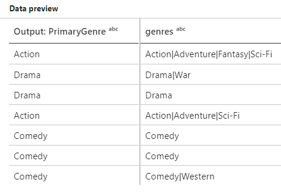

1. **Rank movies via a Window Transformation** Say you are interested in how a movie ranks within its year for its specific genre. You can add a [Window transformation](https://docs.microsoft.com/azure/data-factory/data-flow-window) to define window-based aggregations by clicking on the + icon next to your Derived Column transformation and clicking Window under Schema modifier. To accomplish this, specify what you are windowing over, what you are sorting by, what the range is, and how to calculate your new window columns. In this example, we will window over PrimaryGenre and year with an unbounded range, sort by Rotten Tomato descending, a calculate a new column called RatingsRank which is equal to the rank each movie has within its specific genre-year.

    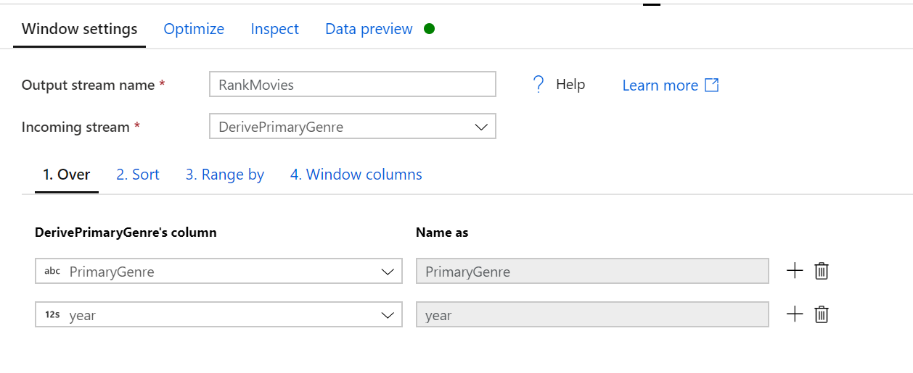

    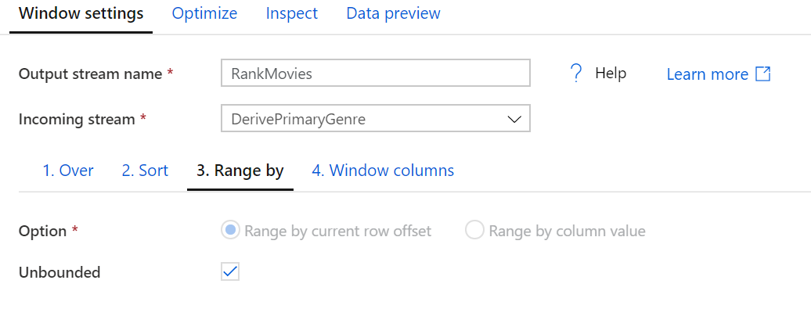

    

    

1. **Aggregate ratings with an Aggregate Transformation** Now that you have gathered and derived all your required data, we can add an [Aggregate transformation](https://docs.microsoft.com/azure/data-factory/data-flow-aggregate) to calculate metrics based on a desired group by clicking on the + icon next to your Window transformation and clicking Aggregate under Schema modifier. As you did in the window transformation, lets group movies by genre and year

    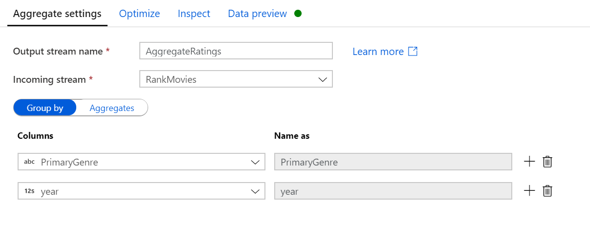

    In the Aggregates tab, you can aggregations calculated over the specified group by columns. For every genre and year, lets get the average Rotten Tomatoes rating, the highest and lowest rated movie (utilizing the windowing function) and the number of movies that are in each group. Aggregation significantly reduces the amount of rows in your transformation stream and only propagates the group by and aggregate columns specified in the transformation.

    * To see how the aggregate transformation changes your data, use the Data Preview tab

    

1. **Specify Upsert condition via an Alter Row Transformation** If you are writing to a tabular sink, you can specify insert, delete, update and upsert policies on rows using the [Alter Row transformation](https://docs.microsoft.com/azure/data-factory/data-flow-alter-row) by clicking on the + icon next to your Aggregate transformation and clicking Alter Row under Row modifier. Since you are always inserting and updating, you can specify that all rows will always be upserted.

    

1. **Write to a SQL DW Sink** Now that you have finished all your transformation logic, you are ready to write to a Sink.
    1. Add a Sink by clicking on the + icon next to your Upsert transformation and clicking Sink under Destination.
    1. In the Sink tab, create a new SQL DW dataset via the + New button.
    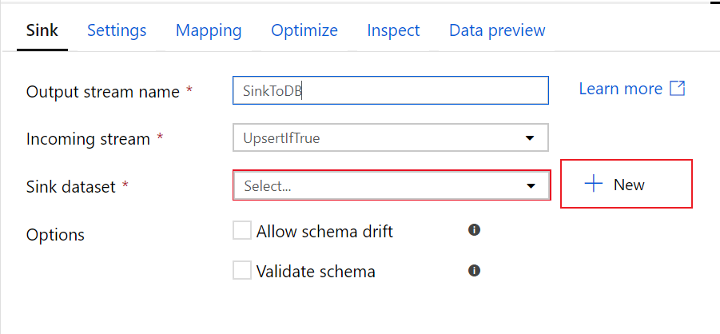
    1. Select Azure SQL Data Warehouse from the tile list.
    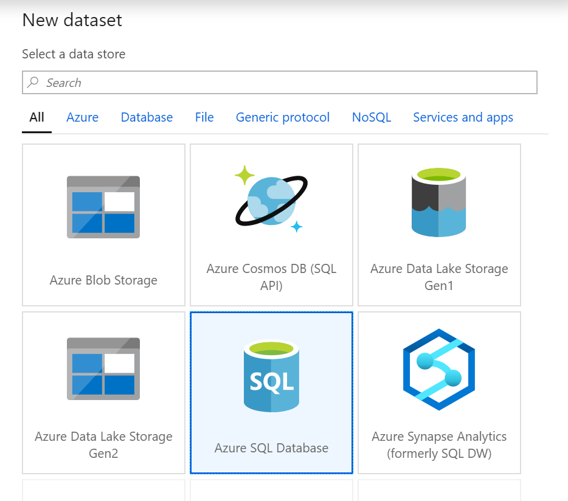
    1. Select a new linked service and configure your SQL DW connection credentials. Click 'Create' when finished.
    
    1. In the dataset configuration, select 'Create new table' and enter in your desired table name. Click 'Finish' once completed.
    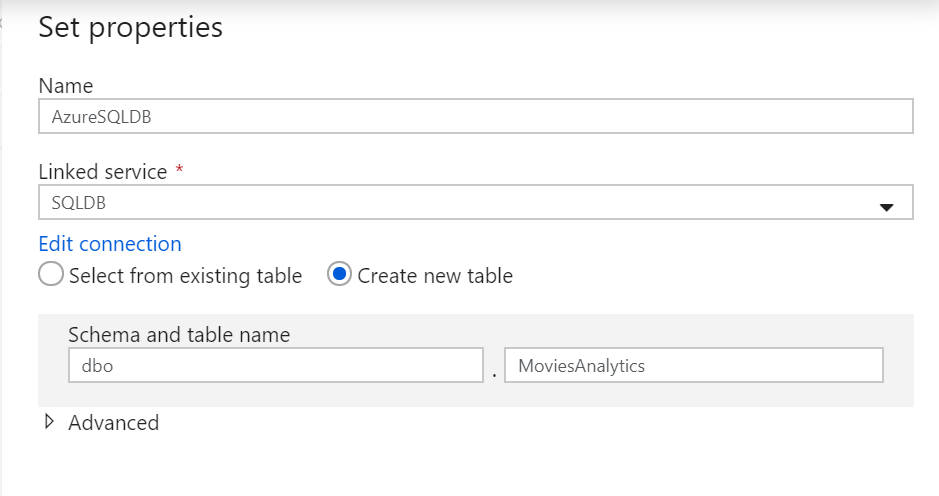
    1. Since an upsert condition was specified, you need to go to the Settings tab and select 'Allow upsert' based on key columns PrimaryGenre and year.
    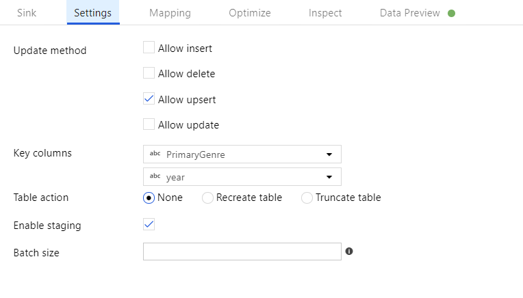
At this point, You have finished building your 8 transformation Mapping Data Flow. It's time to run the pipeline and see the results!

## Running the Pipeline

Go to the pipeline canvas. Because SQL DW in Data Flow uses [PolyBase](https://docs.microsoft.com/sql/relational-databases/polybase/polybase-guide?view=sql-server-2017), you must specify a blob or ADLS staging folder. In the Execute Data Flow activity's settings tab, open up the PolyBase accordion and select your ADLS linked service and specify a staging folder path.

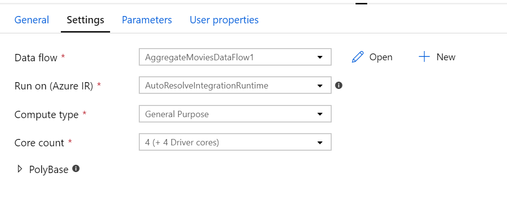

Before you publish your pipeline, run another debug run to confirm it's working as expected. Looking at the Output tab, you can monitor the status of both activities as they are running.

Once both activities succeeded, you can click on the eyeglasses icon next to the Data Flow activity to get a more in depth look at the Data Flow run.

If you used the same logic described in this lab, your Data Flow should will written 737 rows to your SQL DW. You can go into [SQL Server Management Studio](https://docs.microsoft.com/sql/ssms/download-sql-server-management-studio-ssms?view=sql-server-2017) to verify the pipeline worked correctly and see what got written.
