# Movies Analytics using Azure Data Factory

*If you're new to Azure Data Factory, see [Introduction to Azure Data Factory](https://docs.microsoft.com/azure/data-factory/introduction).*

In this Lab, you will utilize Azure Data Factory's visual authoring experience to create a pipeline that copies movie data stored in Azure Data Lake Storage Gen2 to a separate location in that storage account and then executes a Mapping Data Flow to transform and write the data to a Azure Synapse Analytics SQL Pool.

The patterns used in this lab are examples of a modern data warehouse ingestion and transformation scenario using Azure Data Factory.

The a similar pipeline to the one created in this lab is available via the Azure Data Factory [Template Gallery](https://azure.microsoft.com/blog/get-started-quickly-using-templates-in-azure-data-factory/) under the name **Movie Analytics**

Please allot about two hours to complete this lab end to end.

## Prerequisites

* **Azure subscription**: If you don't have an Azure subscription, create a [free account](https://azure.microsoft.com/free/) before you begin.

* **Azure Data Lake Storage Gen2 storage account**: If you don't have an ADLS Gen2 storage account, see the instructions in [Create an ADLS Gen2 storage account](https://docs.microsoft.com/en-us/azure/storage/blobs/data-lake-storage-quickstart-create-account).

* **Azure Synapse Analytics SQL Pool**: If you don't have a SQL DB account, see the instructions in [Create a Synapse SQL pool](https://docs.microsoft.com/en-us/azure/synapse-analytics/sql-data-warehouse/create-data-warehouse-portal).

## Setting up your environment

**Create your data factory:** Use the [Azure Portal](https://portal.azure.com) to create your Data Factory. Detailed instructions can be found at [Create a Data Factory](https://docs.microsoft.com/azure/data-factory/quickstart-create-data-factory-portal).

1. Once in the Azure Portal, click on the **All Services** button on the left hand-side and select "Data Factories" in the Analytics section.
    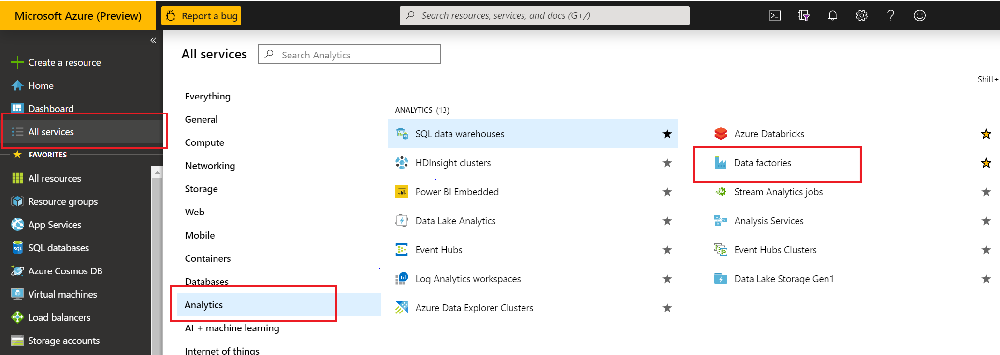

1. Click **Add** to open the Data Factory creation screen
    

1. Specify your Data Factory configuration settings in the creation pane. Choose a globally unique data factory name and select your subscription, resource group, and region. Your data factory must be version V2. Once you are done, click **Create**. Your data factory may take a couple minutes to deploy.
    * Mapping Data Flow is not currently available in the following data factory regions: West Central US, Korea Central and France Central. For the purposes of this lab, please do not create your data factory in one of these reasons. 
    * ADF's integration with Azure DevOps and Github will not be covered in this lab. To enable this feature, check **Enable Git** and specify your configuration information. See [Source Control in Azure Data Factory](https://docs.microsoft.com/azure/data-factory/source-control#troubleshooting-git-integration).
    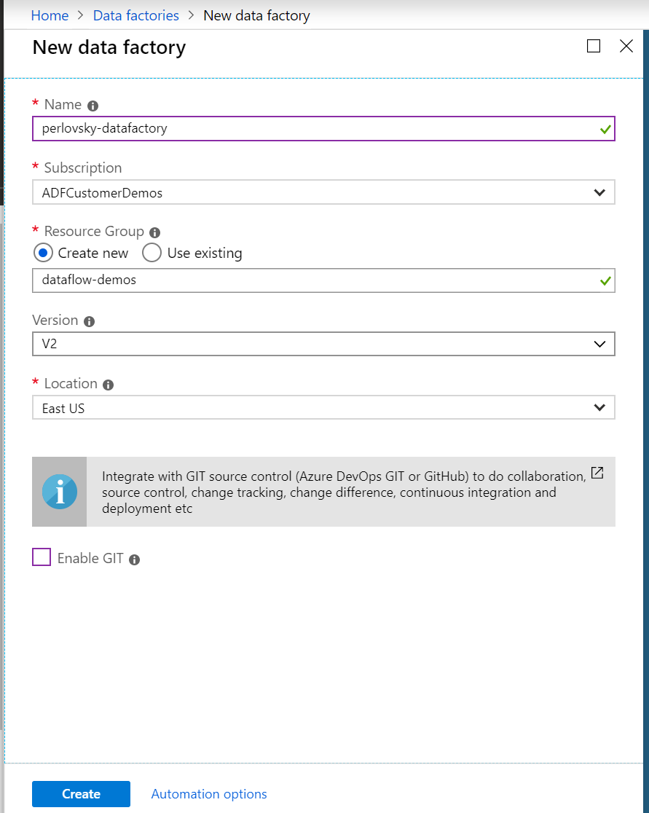

1. Once your data factory is deployed, go to the resource and click on **Authoring and Monitoring** to open the ADF user experience (UX). You can access the UX via adf.azure.com.
    

## Turn on data flow debug mode

In section *Transforming Data with Mapping Data Flow*, you will be building mapping data flows. A best practice before building mapping data flows is to turn on debug mode which allows you to test transformation logic in seconds on an active spark cluster.

To turn on debug, click the **Data flow debug** slider in the factory top bar. Click ok when the confirmation dialog pop-ups. The cluster will take about 5-7 minutes to start-up. Continue on to *Ingesting data into Azure Data Lake Storage Gen2* while it is initializing.

  
## Ingesting data into Azure Data Lake Storage Gen2
  
Once your data factory is created and you open the ADF UX, the first step in your pipeline is creating a Copy Activity that copies the moviesDB.csv file in ADLS Gen2 storage to a separate location in that container. It is assumed your initial source data exists in a container named `sample-data` and a folder named `input`.

1. **Open the authoring canvas** If coming from the ADF homepage, click on the pencil icon on the left sidebar or the create pipeline button to open the authoring canvas.
    
1. **Create the pipeline** Click on the + button in the Factory Resources pane and select Pipeline
    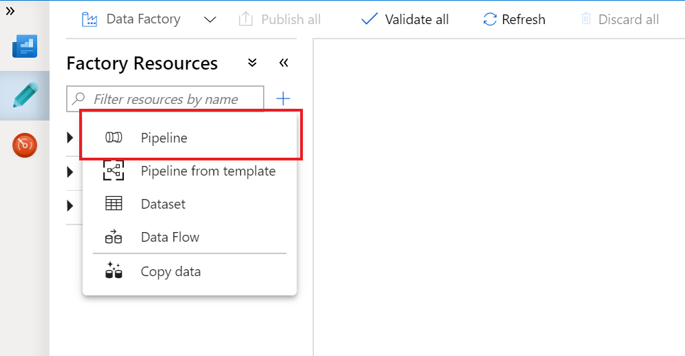
1. **Add a copy activity** In the Activities pane, open the Move and Transform accordion and drag the Copy Data activity onto the pipeline canvas
    
1. **Create a new DelimitedText dataset to use as a source**
    1. In the Source tab of the Copy activity settings, click '+ New'
    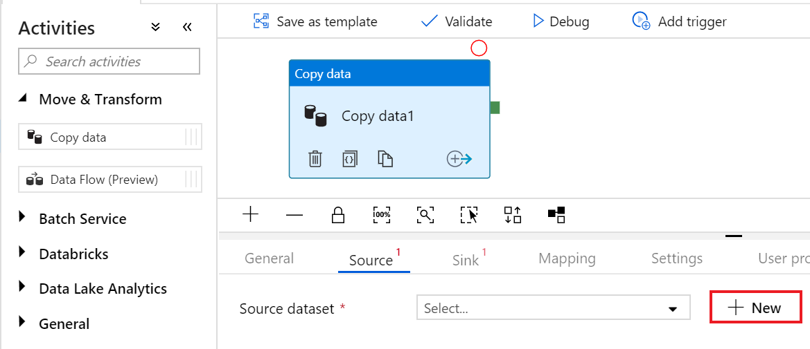
    1. Select the Azure Data lake Storage Gen2 tile and click continue
    
    1. In the file format list, select the DelimitedText format tile and click continue
    
    1. In Set Properties sidenav, give your dataset an understandable name and click on the Linked Service dropdown. If you have not created your ADLS Linked Service, select 'New'.
    
    1. In the ADLS linked service configuration pane, select your authentication method and enter your credentials. In the example below, I used account key and selected my storage account from the drop down.
    
    a. Once you have created and selected the linked service, specify the rest of your dataset settings. These settings specify how and where in your connection we want to pull the data. In the below image, the configuration is reading a delimited text file named `moviesDB.csv` in a container named `sample-data` and a folder named `input`. The file has a header which is why `first row as header` is enabled. This lab is getting the schema directly from the connection. Click finish once completed.
    
    a. To verify your dataset is configured correctly, click 'Preview Data' in the Source tab of the copy activity to get a small snapshot of your data.
    
1. **Create a new DelimitedText dataset to use as a sink**
    1. In the Sink tab, click + New
    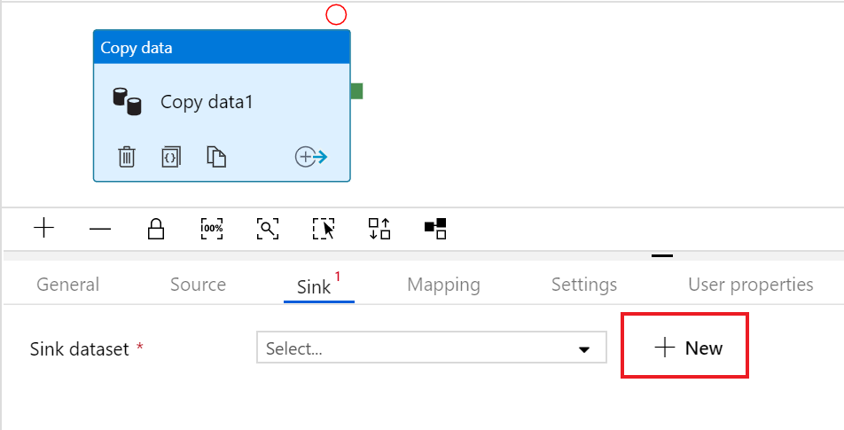
    1. Select the Azure Data lake Storage Gen2 tile and click continue
    
    1. Select the DelimitedText format tile and click continue
    
    1. In the Set Properties sidenav, give your dataset an understandable name and select the `ADLS` linked service created in the source.. As you are writing to this dataset, you want to point the folder and file where you want moviesDB.csv copied to. In the example below, I am writing to the file 'moviesDB.csv' in the folder 'output' in the container 'sample-data'. While the folder and file can be dynamically created, the container must exist prior to writing to it. Set First row as header to be true. If you do not specify this setting, your data will be written without a header which can provide issues later in the lab. Do not specify a schema at this time. Click finish once completed.
    

At this point, you have fully configured your copy activity. To test it out, click on the Debug button at the top of the pipeline canvas. This will start a pipeline debug run.

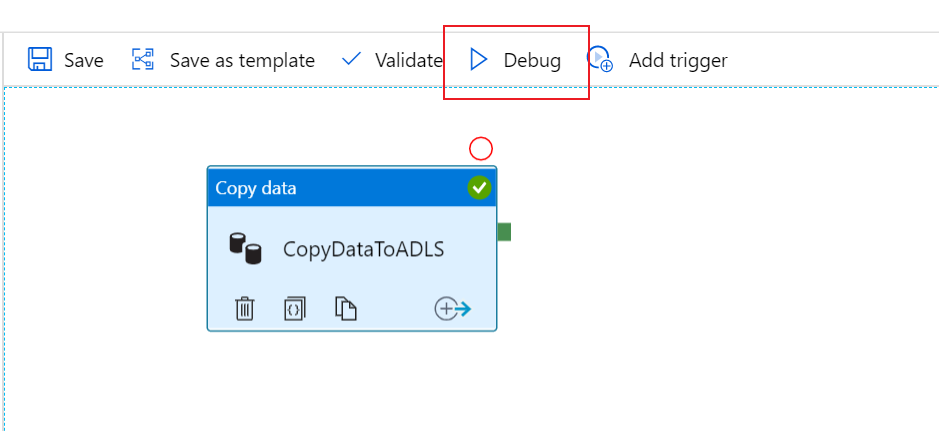

To monitor the progress of a pipeline debug run, click on the Output tab of the pipeline

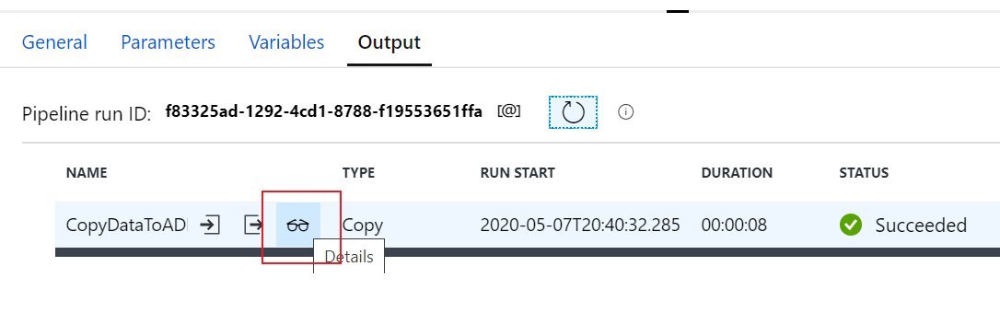

To view a more detailed description of the activity output, click on the eyeglasses icon. This will open up the copy monitoring screen which provides useful metrics such as Data read/written, throughput and in-depth duration statistics.

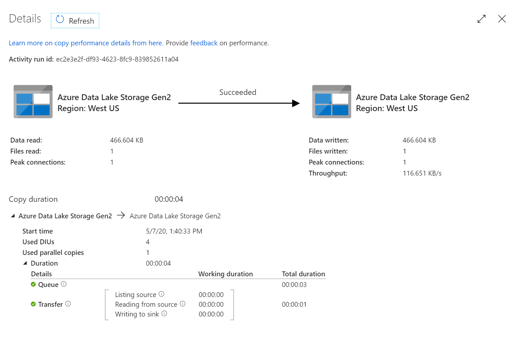

To verify the copy worked as expected, open up your ADLS gen2 storage account and check to see your file was written as expected

## Transforming Data with Mapping Data Flow

Now that you have moved the data into ADLS, you are ready to build a Mapping Data Flow which will transform your data at scale via a spark cluster and then load it into a Data Warehouse. For more information on Mapping Data Flows, see the [Mapping Data Flow documentation](https://docs.microsoft.com/azure/data-factory/concepts-data-flow-overview).

1. **Turn on Data Flow Debug** If you haven't already done so, turn the Data Flow Debug slider located at the top of the authoring module on. Data Flow clusters take 5-7 minutes to warm up and users are recommended to turn on debug first if they plan to do Data Flow development. For more information, see [Debug Mode](https://docs.microsoft.com/azure/data-factory/concepts-data-flow-debug-mode)
    
1. **Add a Data Flow activity** In the Activities pane, open the Move and Transform accordion and drag the Data Flow activity onto the pipeline canvas. In the sidenav that pops up, select Create new Data Flow and select Mapping Data Flow. Go back to the pipeline canvas and drag the green box from your Copy activity to the Data Flow Activity to create an on success condition.
    
1. **Add an ADLS source** Open the Data Flow canvas. Click on the Add Source button in the Data Flow canvas. Name your source `MoviesADLS`. In the source dataset dropdown, select your ADLS Gen2 dataset used in your Copy activity. 

    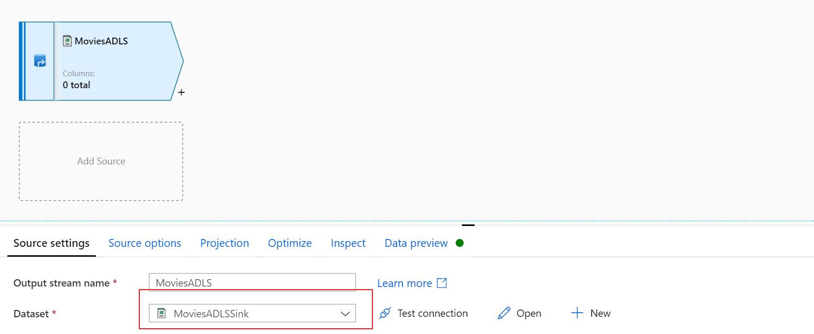

    As we didn't import a schema in the previous section there is no column metadata. Once your debug cluster is on, go to the **Projection** tab and select **Import projection**.

    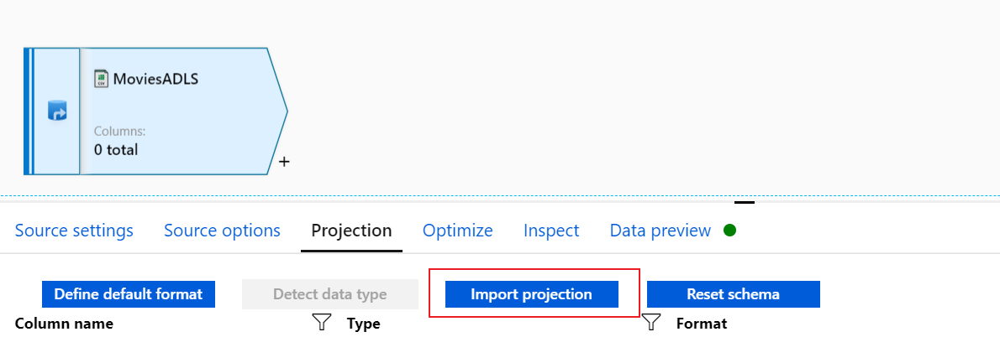

    After a few seconds, you should see a schema appear below.

    

    You can verify your source is configured correctly via the **Data Preview** tab. Click the **Refresh** button. Mapping data flow will use the debug cluster to pull a snapshot of your data at that specific transformation.

    

1. **Add a Select transformation to rename and drop a column**You may have noticed that the Rotton Tomatoes column is misspelled. To correctly name it and drop the unused Rating column, you can add a [Select transformation](https://docs.microsoft.com/azure/data-factory/data-flow-select) by clicking on the + icon next to your ADLS source node and choosing Select under Schema modifier.
    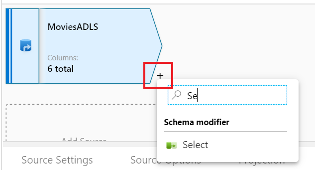

    Give your Select transformation a identifiable name like `SelectAndRename`. In the **Name as** field, change 'Rotton Tomato' to 'Rotten Tomato'. To drop the Rating column, Click on the trash can icon next to the column name

    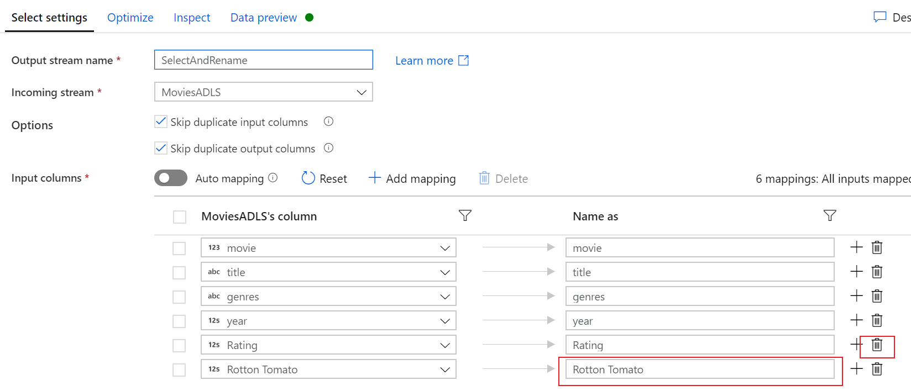

    You should now have 5 remaining columns.

    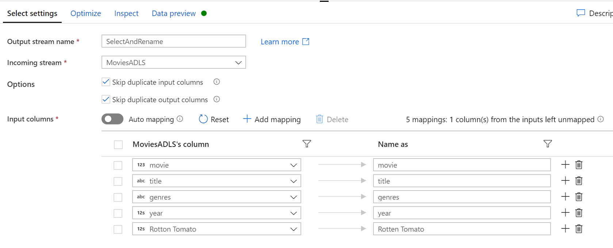

    You can verify your output using data preview.

    

1. **Add a Filter Transformation to filter out unwanted years** Say you are only interested in movies made after 1951. You can add a [Filter transformation](https://docs.microsoft.com/azure/data-factory/data-flow-filter) to specify a filter condition by clicking on the + icon next to your Select transformation and choosing Filter under Row Modifier. Click on the expression box to open up the [Expression builder](https://docs.microsoft.com/azure/data-factory/concepts-data-flow-expression-builder) and enter in your filter condition.

    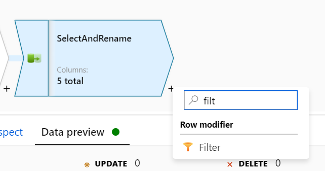

    Give your filter transformation an identifiable name such as `FilterYearsBefore1950`. Click the **Filter on** expression box.

    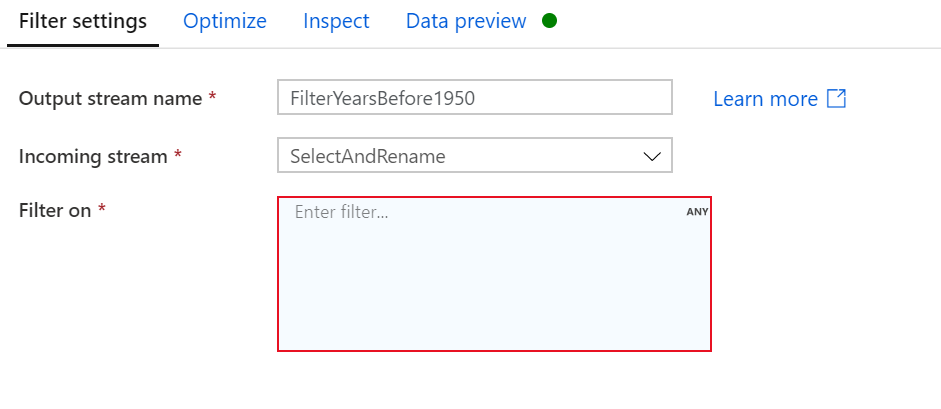

    This will open up the data flow expression builder. The expression builder allows you to construct expressions composed of column values, parameters, functions, operators, and literals. Using the syntax of the [Mapping Data Flow expression language](https://docs.microsoft.com/azure/data-factory/data-flow-expression-functions), `year > 1950` will filter rows where the `year` column value is greater than 1950.

    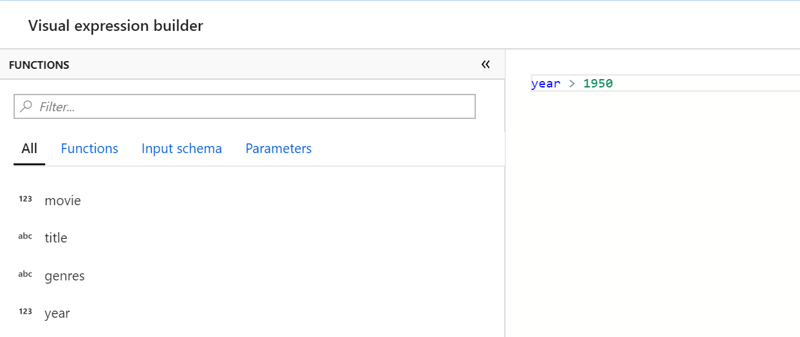

    To preview what the expression evaluates to, use the expression builder's data preview capability. Clicking refresh will fetch a sample of rows that shows the inputs and output of the function.

    

    Click **Save and finish** when complete.

1. **Add a Derive Transformation to calculate primary genre** As you may have noticed, the genres column is a string delimited by a '|' character. If you only care about the first genre in each column, you can derive a new column via the [Derived Column](https://docs.microsoft.com/azure/data-factory/data-flow-derived-column) transformation by clicking on the + icon next to your Filter transformation and choosing derived column under Schema Modifier.

    

    Name your transformation `DerivePrimaryGere. Similar to the filter transformation, the derived column uses the Mapping Data Flow expression builder to specify column values. In the left textbox selector, enter **Primary Genre**. Click on the expression box to assign the new column a value. The expression builder will open.

    

    In this scenario, you are trying to extract the first genre from the genres column which is formatted as 'genre1|genre2|...|genreN'. While there are a variety of ways to do this, one way is using the `split()` which converts a delimited string into an array. `split()` takes in two parameters, the string to split and the delimiter. In this case, the string is the column `genres` and the delimiter is the character `'|'`. We are only interested in the first element of the output array which can be accessed using bracket notation, `[1]`. The finished expression is `split(genres, '|')[1]`.

    

    As we did in filter, use data preview to confirm the output of the expression.

    

    Click **Save and finish** when complete.

1. **Rank movies via a Window Transformation** Say you are interested in how a movie ranks within its year for its specific genre. You can add a [Window transformation](https://docs.microsoft.com/azure/data-factory/data-flow-window) to define window-based aggregations by clicking on the + icon next to your Derived Column transformation and clicking Window under Schema modifier.

    

    Name your window transformation `RankMoviesByRatings`. First select your group by columns to specify which rows fall into each window. The two group by columns will be `PrimaryGenre` and `year`. To add a group by column, click on the plus icon next to any existing group by column.

    

    Next, go to the **Sort** tab and specify a sort order for each window group. Because we are interested in ranking the highest rated movies according to `Rotten Tomato` first, the sort column is `Rotton Tomato` and the order is descending.

    

    The **Range by** tab allows you to specify your window bounds. Keep the default setting of **Unbounded** selected.

    

    In the **Window columns** tab, specify new columns to generate based upon your windows. Add a column `RatingRank` that has a value of `rank()`. `rank()` is a unique window function that returns the rank of a row in its window according the the sort order specified in the **Sort** tab. 

    

    Verify your output using data preview.

    

1. **Aggregate ratings with an Aggregate Transformation** Now that you have gathered and derived all your required data, we can add an [Aggregate transformation](https://docs.microsoft.com/azure/data-factory/data-flow-aggregate) to calculate metrics based on a desired group by clicking on the + icon next to your Window transformation and clicking Aggregate under Schema modifier. 

    

    Name your aggregate transformation `AggregateRatings`. As you did in the window transformation, select `PrimaryGenre` and `Year` as group by columns.

    

    In the Aggregates tab, you calculate aggregations over specified group by columns. For every primary genre and year, lets get the average Rotten Tomatoes rating, the highest and lowest rated movie (utilizing the windowing function) and the number of movies that are in each group. As the data was sorted in the window transformation, you can use the `first()` and `last()` functions to get the highest and lowest rated values. Create four columns with the following names and expressions:

    | Column Name | Expression |
    | ----------- | ---------- |
    | AverageRating | `avg({Rotten Tomato})` |
    | HighestRated | `first(title)` |
    | LowestRated | `last(title)` |
    | NumberOfMovies | `count()` |

    

    Aggregation significantly reduces the amount of rows in your transformation stream and only propagates the group by and aggregate columns specified in the transformation. Go to the **Inspect** to see the outputted metadata.

    

    Verify your output using data preview. There should be only one row per unique PrimaryGenre-year combination.

    

1. **Write to a Synapse Analytics SQL Pool** Once you have finished your transformation logic, you are ready to write to your sink. In this lab, you are going to create a new Synapse Analytics SQL Pool. To add a sink, click on the + icon next to your Aggregate transformation and select Sink.

    

    Name your sink `SynapseSink` and select a new dataset.

    

    Select the Azure Synapse Analytics tile.

    

    Name your dataset `SynapseSink` and select a new linked service.

    

    Name your linked service `Synapse` and enter in your credentials. The below example uses SQL authentication. Click OK when finished.

    

    In the Set properties pane, select **Create new table**. Enter in `dbo` for your schema name and `MovieAnalytics` for your table name. Click OK when finished.

    

    Your Synapse sink is now fully configured.

    

At this point, You have finished building your 7 transformation Mapping Data Flow. It's time to run the pipeline and see the results!

## Running the Pipeline

Go to the pipeline canvas. In the Execute Data Flow activity's settings tab, you will see the data flow selected and the compute environment used. In this lab, you should use the default 4 core general purpose cluster. Since you are writing to Synapse, PolyBase staging is enabled by default. This allows for efficient bulk loading into Azure Synapse Analytics. To use this feature, you must specify a staging storage account. In the **Staging linked service** dropdown, select the `ADLS` linked service you created earlier. For **Staging storage folder**, select `sample-data` for the container and `staging` for the folder path.

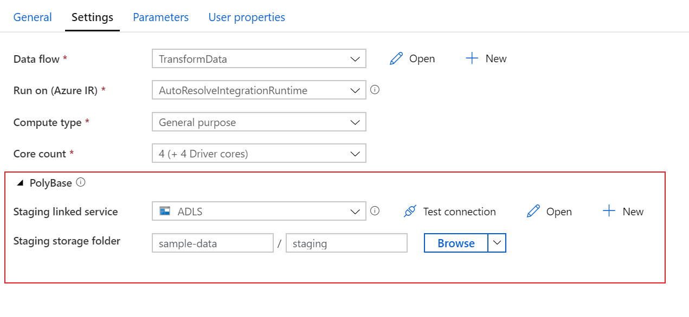

Before you publish your pipeline, run another debug run to confirm it's working as expected. 

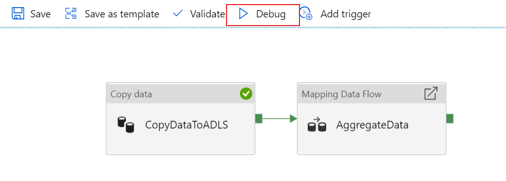

Look at the **Output** tab, you can monitor the status of both activities as they are running. You can click on the eyeglasses icon next to the Data Flow activity to get a more in depth look at the Data Flow run.

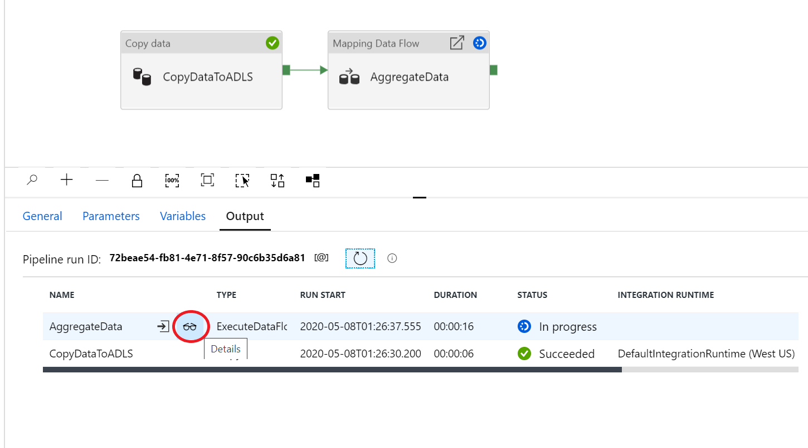

In the detailed view, you can see how long each transformation stage takes, view each transformations partitioning information and see how long it took to write to the sink.

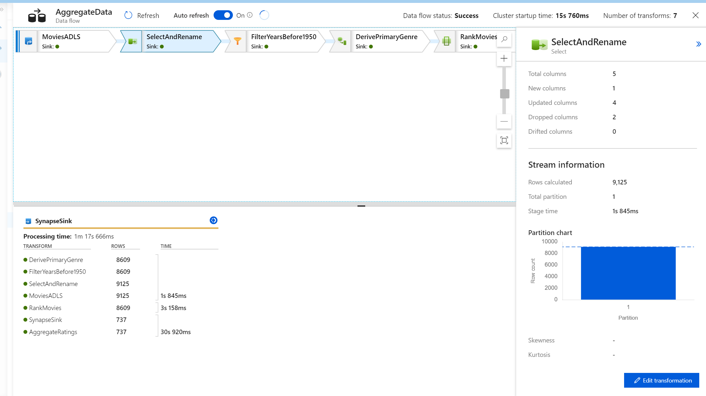

The data flow activity should complete in about one minute. If you used the same logic described in this lab, your Data Flow should will written 737 rows to your SQL DW. You can go into [SQL Server Management Studio](https://docs.microsoft.com/sql/ssms/download-sql-server-management-studio-ssms?view=sql-server-2017) to verify the pipeline worked correctly and see what got written.

Once you verify your pipeline is working, publish your changes! Feel free to continue to play around with Azure Data Factory and build your code-free ETL work flows.
